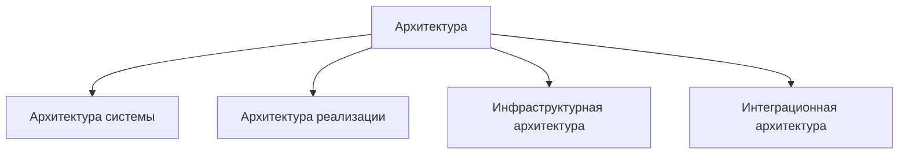
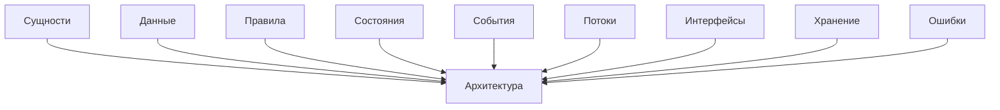

# Architecture / Архитектура

## 1. Назначение документа

`Architecture.md` раскрывает понятие архитектуры при проектировании цифровых систем.

Документ используется как энциклопедическая статья и как опорный материал для roadmap-документов, анкет, технических требований, архитектуры системы, архитектуры реализации и примеров.

Документ не является roadmap-документом. Документ объясняет, что такое архитектура, какие уровни архитектуры существуют и как архитектура связывает сущности, данные, правила, состояния, события, потоки, хранение, ошибки и интерфейсы.

## 2. Место документа в системе знаний

Документ относится к энциклопедическому слою проекта Programming Digital Systems.

Документ используется после `docs/05_encyclopedia/Interfaces.md`.

Архитектура определяется после интерфейсов, потому что архитектура должна описывать не только части системы, но и границы взаимодействия между ними.

## 3. DEF-ARCH-001. Определение архитектуры

Архитектура — это структурная организация цифровой системы, которая определяет её основные части, границы ответственности, связи, зависимости, интерфейсы, потоки, правила взаимодействия и принципы развития.

Архитектура считается определённой корректно, если для неё указаны:

- назначение системы;
- архитектурные элементы;
- границы ответственности;
- слои;
- модули;
- модели;
- интерфейсы;
- зависимости;
- потоки;
- конфигурации;
- точки расширения;
- ограничения;
- критерии проверки архитектурных решений.

## 4. Зачем определять архитектуру

Архитектура нужна для того, чтобы проектировщик мог:

- разделить систему на управляемые части;
- определить границы ответственности;
- уменьшить хаотичные зависимости;
- отделить предметную логику от технической реализации;
- обеспечить тестируемость;
- обеспечить расширяемость;
- определить интерфейсы;
- подготовить технические требования;
- подготовить выбор инструментария;
- подготовить реализацию.

Если архитектура не определена, код начинает управлять проектом вместо проектного решения.

## 5. Уровни архитектуры

### 5.1. Архитектура системы

Архитектура системы определяет, как система должна быть организована на логическом и структурном уровне до выбора конкретных инструментов реализации.

Архитектура системы отвечает за:

- слои;
- модули;
- модели;
- интерфейсы;
- зависимости;
- конфигурации;
- точки расширения;
- архитектурные ограничения.

Архитектура системы не должна выбирать конкретную библиотеку, фреймворк или структуру файлов реализации.

### 5.2. Архитектура реализации

Архитектура реализации определяет, как архитектура системы будет реализована в конкретном коде, инструментах, библиотеках, фреймворках, директориях, классах, модулях и технических компонентах.

Архитектура реализации отвечает за:

- структуру проекта;
- конкретные модули кода;
- технические адаптеры;
- выбранные библиотеки;
- правила сборки;
- правила запуска;
- правила организации кода;
- соглашения реализации.

Архитектура реализации не должна изменять архитектуру системы без фиксации проектного изменения.

### 5.3. Инфраструктурная архитектура

Инфраструктурная архитектура определяет окружение, в котором система работает.

Примеры:

- операционная система;
- сеть;
- файловая система;
- база данных;
- контейнеры;
- облачная среда;
- промышленное оборудование;
- контроллеры;
- CI/CD.

### 5.4. Интеграционная архитектура

Интеграционная архитектура определяет, как система взаимодействует с внешними системами.

Примеры:

- API;
- очереди сообщений;
- файловый обмен;
- импорт и экспорт;
- обмен с PLC;
- обмен с HMI;
- обмен с базой данных;
- обмен с CAM/CNC-системами.

## 6. DG-ARCH-001. Уровни архитектуры

Назначение: показать основные уровни архитектуры цифровой системы.

## 7. Основные архитектурные элементы

### 7.1. Слои

Слои разделяют систему на крупные области ответственности.

Примеры:

- слой представления;
- слой сценариев приложения;
- слой бизнес-логики;
- слой доменной модели;
- слой данных;
- слой хранения;
- слой инфраструктуры;
- слой конфигурации;
- слой ошибок и логирования.

### 7.2. Модули

Модули разделяют систему на отдельные функциональные части.

Примеры:

- модуль чтения файлов;
- модуль парсинга;
- модуль валидации;
- модуль расчётов;
- модуль хранения;
- модуль отчётов;
- модуль логирования.

### 7.3. Модели

Модели формализуют сущности, данные, состояния, события, ошибки и связи.

Примеры:

- доменная модель;
- модель входных данных;
- модель выходных данных;
- модель состояния;
- модель события;
- модель ошибки;
- модель конфигурации.

### 7.4. Интерфейсы

Интерфейсы определяют границы взаимодействия.

Примеры:

- пользовательский интерфейс;
- интерфейс модуля;
- интерфейс слоя;
- интерфейс хранения;
- интерфейс внешней системы;
- аппаратный интерфейс.

### 7.5. Зависимости

Зависимости определяют, какие части системы используют другие части.

Примеры:

- модуль зависит от интерфейса хранения;
- слой представления зависит от слоя сценариев приложения;
- доменная модель не зависит от GUI;
- инфраструктурный адаптер зависит от внешнего API.

### 7.6. Конфигурации

Конфигурации определяют изменяемые параметры поведения системы.

Примеры:

- пути к файлам;
- параметры подключения;
- пороги предупреждений;
- настройки логирования;
- режимы работы.

### 7.7. Точки расширения

Точки расширения определяют места, где система может развиваться без разрушения архитектуры.

Примеры:

- новый входной формат;
- новый тип отчёта;
- новый драйвер устройства;
- новая интеграция;
- новый модуль проверки.

## 8. DG-ARCH-002. Связь архитектуры с базовыми понятиями

Назначение: показать, что архитектура строится на базовых понятиях проектирования системы.

## 9. Правила анализа архитектуры

### RULE-ARCH-001. Архитектура должна иметь границы ответственности

Каждый слой, модуль и интерфейс должен иметь понятную ответственность.

### RULE-ARCH-002. Архитектура должна иметь допустимые зависимости

Необходимо определить, какие зависимости разрешены и какие запрещены.

### RULE-ARCH-003. Архитектура должна отделять доменную логику от технической инфраструктуры

Предметные правила системы не должны зависеть от деталей GUI, файловой системы, базы данных или внешнего API.

### RULE-ARCH-004. Архитектура должна учитывать ошибки

Ошибки не должны быть случайной частью реализации. Архитектура должна определять, где ошибки возникают, где обрабатываются и где отображаются.

### RULE-ARCH-005. Архитектура должна учитывать расширение

Точки расширения должны быть определены там, где развитие системы вероятно или требуется.

### RULE-ARCH-006. Архитектура системы не должна смешиваться с архитектурой реализации

Неправильно:

> Архитектура системы использует PySide6 и SQLite.

Правильно:

> Архитектура системы содержит слой представления и слой хранения. Конкретный GUI-фреймворк и инструмент хранения выбираются позже.

## 10. Примеры применения

### 10.1. Скрипт автоматизации

Архитектура:

- слой чтения данных;
- слой проверки;
- слой обработки;
- слой отчётов;
- слой логирования.

Цель архитектуры: не смешивать чтение файлов, бизнес-правила, расчёты и запись результата в одном неуправляемом скрипте.

### 10.2. GUI-приложение

Архитектура:

- слой представления;
- слой сценариев приложения;
- слой доменной логики;
- слой хранения;
- слой инфраструктуры.

Цель архитектуры: отделить визуальный интерфейс от правил системы и хранения данных.

### 10.3. Embedded-система

Архитектура:

- слой драйверов;
- слой чтения датчиков;
- слой состояния;
- слой логики управления;
- слой диагностики.

Цель архитектуры: отделить работу с железом от логики управления.

### 10.4. PLC-система

Архитектура:

- слой входных сигналов;
- слой режимов работы;
- слой межблокировок;
- слой управления исполнительными механизмами;
- слой аварий;
- слой HMI.

Цель архитектуры: обеспечить безопасное и проверяемое управление технологическим процессом.

### 10.5. CNC/CAM-система

Архитектура:

- слой чтения NC-файлов;
- слой анализа операций;
- слой модели инструмента;
- слой расчётов;
- слой отчётов;
- слой интеграции с таблицами или базой данных.

Цель архитектуры: отделить парсинг программ от анализа, расчётов и вывода результата.

## 11. Контрольные вопросы

Перед переходом к roadmap архитектуры системы необходимо ответить:

1. Какие слои нужны системе?
2. Какие модули нужны системе?
3. Какие модели нужны системе?
4. Какие интерфейсы нужны системе?
5. Какие зависимости допустимы?
6. Какие зависимости запрещены?
7. Какие конфигурации нужны системе?
8. Какие точки расширения нужны системе?
9. Какие ошибки должна учитывать архитектура?
10. Какие потоки проходят через архитектурные границы?
11. Какие элементы относятся к архитектуре системы?
12. Какие элементы относятся к архитектуре реализации?

## 12. Критерии завершения работы с архитектурой как понятием

Работа с архитектурой считается завершённой, если:

- определён уровень архитектуры;
- архитектура системы отделена от архитектуры реализации;
- определены основные архитектурные элементы;
- определены границы ответственности;
- определены допустимые зависимости;
- определены интерфейсы;
- определены точки расширения;
- архитектура связана с сущностями, данными, правилами, состояниями, событиями, потоками, хранением и ошибками.

## 13. Связанные документы

### Входные документы

- `docs/05_encyclopedia/Entities.md`
  - Передаёт: сущности, которые могут стать доменными моделями и модулями.
  - Используется для: построения архитектурных элементов предметной области.
  - Ограничение: не определяет архитектуру.

- `docs/05_encyclopedia/Data.md`
  - Передаёт: виды данных и требования к данным.
  - Используется для: проектирования моделей данных, интерфейсов данных и хранения.
  - Ограничение: не определяет слои и зависимости.

- `docs/05_encyclopedia/Flows.md`
  - Передаёт: движение данных, команд, событий и ошибок.
  - Используется для: определения модулей, интерфейсов и зависимостей.
  - Ограничение: не определяет архитектуру целиком.

- `docs/05_encyclopedia/Interfaces.md`
  - Передаёт: границы взаимодействия.
  - Используется для: проектирования слоёв, модулей и интеграций.
  - Ограничение: не описывает полную архитектурную организацию.

### Выходные документы

- `docs/03_roadmaps/02_02_Roadmap_System_Architecture_Design.md`
  - Получает: базовое понятие архитектуры и основные архитектурные элементы.
  - Используется для: пошагового проектирования архитектуры системы.
  - Ограничение: должен быть roadmap-документом, а не энциклопедической статьёй.

- `docs/03_roadmaps/06_06_Roadmap_Implementation_Architecture.md`
  - Получает: различие между архитектурой системы и архитектурой реализации.
  - Используется для: преобразования архитектуры системы в конкретную структуру кода и инструментов.
  - Ограничение: не должен подменять архитектуру системы.

- `docs/03_roadmaps/05_05_Roadmap_Toolchain_Selection.md`
  - Получает: архитектурные ограничения и уровни архитектуры.
  - Используется для: выбора инструментов, соответствующих архитектуре системы.
  - Ограничение: не должен формировать архитектуру вместо проектировщика.
