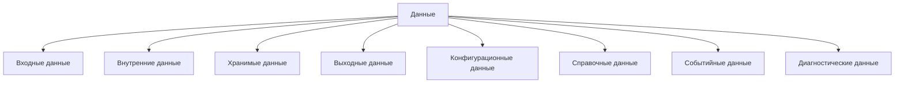
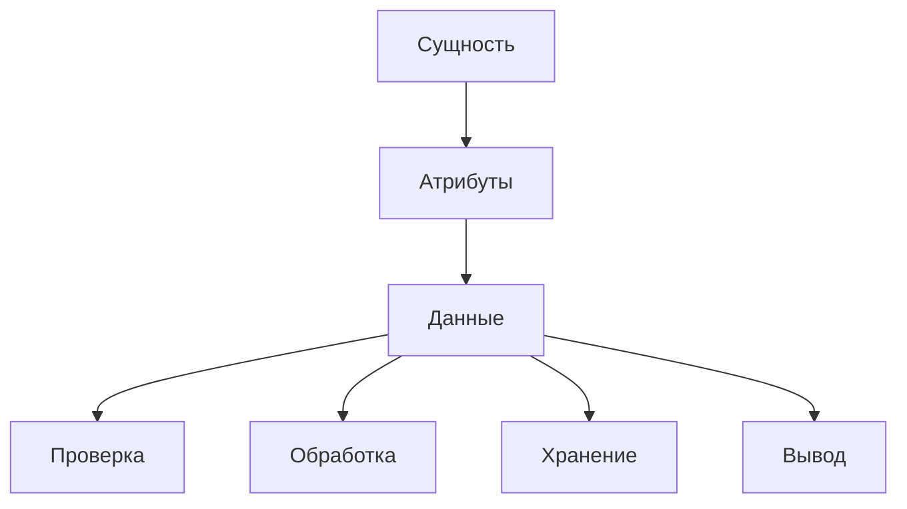
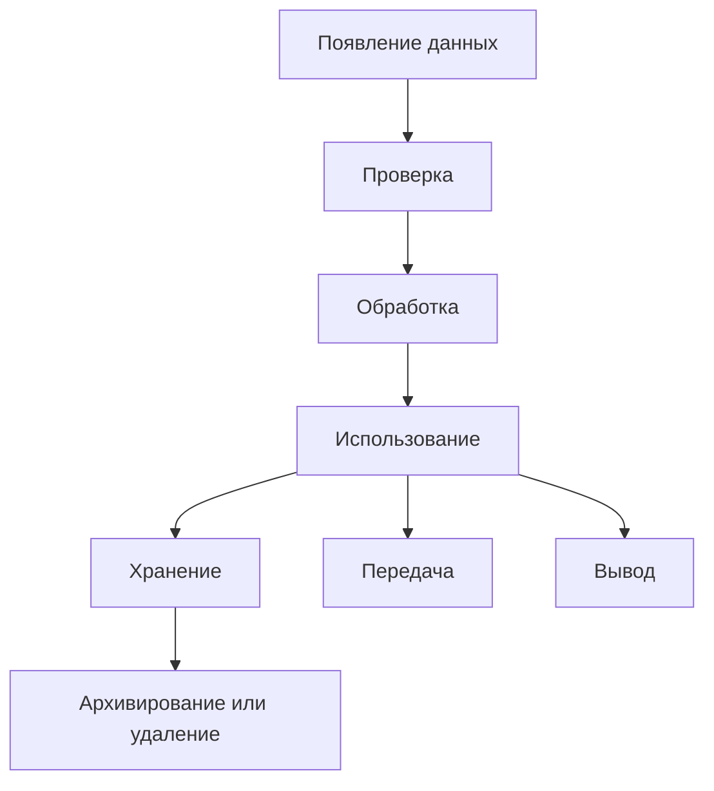

# Data / Данные

## 1. Назначение документа

`Data.md` раскрывает понятие данных при проектировании цифровых систем.

Документ используется как энциклопедическая статья и как опорный материал для roadmap-документов, анкет, технических требований и примеров.

Документ не является roadmap-документом. Документ объясняет понятие данных, виды данных, правила анализа данных и связь данных с другими элементами цифровой системы.

## 2. Место документа в системе знаний

Документ относится к энциклопедическому слою проекта Programming Digital Systems.

Документ используется после `docs/05_encyclopedia/Entities.md`.

Данные определяются после сущностей, потому что данные описывают сущности, состояния, события, потоки, настройки и результаты работы системы.

## 3. DEF-DATA-001. Определение данных

Данные — это значения, сведения, параметры, сигналы, записи или сообщения, которые цифровая система получает, хранит, обрабатывает, передаёт или формирует как результат.

Данные считаются определёнными корректно, если для них можно указать:

- источник;
- назначение;
- формат;
- структуру;
- обязательность;
- допустимые значения;
- правило проверки;
- место использования;
- способ хранения или передачи;
- действие при ошибке.

## 4. Зачем определять данные

Данные нужно определять для того, чтобы проектировщик мог:

- понять, что система получает на вход;
- понять, что система должна обработать;
- понять, что система должна сохранить;
- понять, что система должна передать;
- понять, что система должна выдать пользователю или внешней системе;
- определить требования к проверке;
- определить требования к хранению;
- определить требования к интерфейсам;
- определить ошибки и исключительные ситуации.

Если данные не определены, невозможно корректно сформулировать технические требования.

## 5. Основные виды данных

### 5.1. Входные данные

Входные данные — это данные, которые система получает до начала обработки или во время выполнения.

Примеры:

- Скрипт автоматизации
  - Excel-файл.
  - PDF-файл.
  - CSV-файл.
  - JSON-файл.
- GUI-приложение
  - Значение поля ввода.
  - Выбранный файл.
  - Команда пользователя.
- Embedded-система
  - Сигнал датчика.
  - Значение АЦП.
  - Состояние кнопки.
- PLC-система
  - Дискретный вход.
  - Аналоговый сигнал.
  - Команда HMI.
- CNC/CAM-система
  - NC-программа.
  - Таблица инструмента.
  - Параметры операции.

### 5.2. Внутренние данные

Внутренние данные — это данные, которые система создаёт и использует во время обработки.

Примеры:

- промежуточный расчёт;
- временный список;
- состояние обработки;
- результат парсинга;
- флаг проверки;
- буфер измерений;
- текущий режим работы.

### 5.3. Хранимые данные

Хранимые данные — это данные, которые должны сохраняться между запусками системы или в течение длительного времени.

Примеры:

- настройки пользователя;
- база деталей;
- журнал измерений;
- история изменений;
- архив обработанных файлов;
- таблица инструментов;
- параметры оборудования.

### 5.4. Выходные данные

Выходные данные — это данные, которые система формирует как результат работы.

Примеры:

- отчёт;
- лог;
- обновлённый файл;
- управляющая команда;
- сообщение пользователю;
- экспортированный JSON;
- рассчитанное значение;
- сигнал управления.

### 5.5. Конфигурационные данные

Конфигурационные данные — это данные, которые задают правила работы системы без изменения кода.

Примеры:

- путь к папке;
- список материалов;
- пороги предупреждений;
- настройки интерфейса;
- параметры подключения;
- карта соответствий;
- шаблон документа.

### 5.6. Справочные данные

Справочные данные — это данные, которые используются как устойчивый источник допустимых значений.

Примеры:

- список материалов;
- список типов инструментов;
- список пользователей;
- таблица кодов ошибок;
- список режимов работы;
- список единиц измерения.

### 5.7. Событийные данные

Событийные данные — это данные, которые возникают при событии и описывают факт изменения.

Примеры:

- время события;
- тип события;
- источник события;
- старое значение;
- новое значение;
- пользователь или устройство, вызвавшее событие.

### 5.8. Диагностические данные

Диагностические данные — это данные, которые помогают понять состояние системы и причины ошибок.

Примеры:

- лог ошибки;
- код ошибки;
- traceback;
- состояние входов PLC;
- статус устройства;
- время выполнения операции;
- результат проверки.

## 6. DG-DATA-001. Общая классификация данных

Назначение: показать основные виды данных в цифровой системе.

Пояснение: классификация помогает проектировщику проверить, какие данные участвуют в системе и какие требования необходимо сформировать.

## 7. Связь данных с сущностями

Данные должны быть связаны с сущностями.

Если данные не относятся ни к одной сущности, процессу, состоянию, событию, настройке или результату, необходимость этих данных должна быть проверена.

## 8. Правила анализа данных

### RULE-DATA-001. У каждого вида данных должен быть источник

Для каждого типа данных необходимо определить, откуда он поступает.

Источник может быть:

- пользователь;
- файл;
- база данных;
- датчик;
- PLC;
- API;
- другая программа;
- внутренняя функция;
- конфигурация.

### RULE-DATA-002. У данных должен быть формат

Для каждого типа данных необходимо определить формат.

Примеры форматов:

- строка;
- число;
- дата;
- логическое значение;
- таблица;
- JSON;
- CSV;
- XML;
- бинарный пакет;
- сигнал;
- структура;
- объект.

### RULE-DATA-003. У данных должно быть правило проверки

Для каждого важного типа данных необходимо определить, как система проверяет корректность.

Проверка может включать:

- обязательность;
- тип значения;
- диапазон;
- формат;
- уникальность;
- связь с другой сущностью;
- контроль единиц измерения;
- контроль допустимого состояния.

### RULE-DATA-004. Данные должны иметь действие при ошибке

Для каждого критичного типа данных необходимо определить, что делает система при ошибке.

Возможные действия:

- остановить обработку;
- пропустить запись;
- записать предупреждение;
- запросить исправление;
- использовать значение по умолчанию;
- перейти в аварийное состояние;
- заблокировать команду.

### RULE-DATA-005. Данные не должны смешиваться с инструментом хранения

Неправильно:

> Данные должны храниться в SQLite.

Правильно:

> Система должна сохранять данные между запусками в структурированном виде.

Выбор SQLite относится к Roadmap выбора инструментария.

### RULE-DATA-006. Данные должны иметь жизненный цикл

Для важных данных необходимо определить:

- когда данные появляются;
- кто или что создаёт данные;
- где данные используются;
- изменяются ли данные;
- сохраняются ли данные;
- когда данные становятся недействительными;
- нужно ли хранить историю изменений.

## 9. Жизненный цикл данных

Пояснение: жизненный цикл данных помогает определить требования к проверке, хранению, логированию и безопасности.

## 10. Примеры применения

### 10.1. Скрипт автоматизации

Контекст: скрипт читает таблицы и формирует отчёт.

Данные:

- Входные данные
  - Excel-файл.
  - PDF-файл.
  - Папка с исходными файлами.
- Внутренние данные
  - Список найденных деталей.
  - Промежуточные результаты парсинга.
- Хранимые данные
  - JSON-файл результата.
- Выходные данные
  - Лог обработки.
  - Итоговый отчёт.

### 10.2. GUI-приложение

Контекст: пользователь редактирует шаблон документа.

Данные:

- Входные данные
  - Действие пользователя.
  - Значение поля ввода.
- Внутренние данные
  - Текущий выбранный элемент.
  - Состояние предпросмотра.
- Хранимые данные
  - Шаблон.
  - Настройки пользователя.
- Выходные данные
  - Экспортированный файл.

### 10.3. Embedded-система

Контекст: контроллер считывает датчик и управляет клапаном.

Данные:

- Входные данные
  - Сигнал датчика.
  - Состояние кнопки.
- Внутренние данные
  - Отфильтрованное значение.
  - Текущее состояние автомата.
- Выходные данные
  - Команда клапану.
  - Диагностический статус.

### 10.4. PLC-система

Контекст: PLC управляет технологическим процессом.

Данные:

- Входные данные
  - Дискретные входы.
  - Аналоговые значения.
  - Команды HMI.
- Внутренние данные
  - Состояние режима.
  - Таймеры.
  - Флаги межблокировок.
- Выходные данные
  - Команды приводам.
  - Аварийные сообщения.

### 10.5. CNC/CAM-система

Контекст: система анализирует NC-программы и инструмент.

Данные:

- Входные данные
  - NC-файл.
  - Таблица инструмента.
  - Параметры операции.
- Внутренние данные
  - Найденные вызовы инструмента.
  - Расчёт времени обработки.
- Хранимые данные
  - История использования инструмента.
- Выходные данные
  - Отчёт по инструментам.
  - Предупреждения.

## 11. Контрольные вопросы

Перед переходом к правилам системы необходимо ответить:

1. Какие входные данные получает система?
2. Какие внутренние данные создаёт система?
3. Какие данные нужно хранить?
4. Какие данные являются выходными?
5. Какие данные являются конфигурационными?
6. Какие данные являются справочными?
7. Какие данные возникают при событиях?
8. Какие данные нужны для диагностики?
9. Для каждого типа данных указан источник?
10. Для каждого типа данных указан формат?
11. Для каждого критичного типа данных указано правило проверки?
12. Для каждого критичного типа данных указано действие при ошибке?

## 12. Критерии завершения работы с данными

Работа с данными считается завершённой, если:

- данные разделены по видам;
- для входных данных указан источник;
- для данных указан формат;
- для критичных данных указано правило проверки;
- для критичных данных указано действие при ошибке;
- данные связаны с сущностями;
- определено, какие данные нужно хранить;
- определено, какие данные являются результатом;
- открытые вопросы вынесены отдельно;
- данные могут быть использованы в технических требованиях.

## 13. Связанные документы

### Входные документы

- `PROJECT_SCOPE.md`
  - Передаёт: центральную формулу цифровой системы.
  - Используется для: определения роли данных во всех типах цифровых систем.
  - Ограничение: не классифицирует данные подробно.

- `docs/05_encyclopedia/Entities.md`
  - Передаёт: понятие сущности и виды сущностей.
  - Используется для: связи данных с сущностями.
  - Ограничение: не раскрывает типы данных подробно.

### Выходные документы

- `docs/05_encyclopedia/Rules.md`
  - Получает: данные как основу для правил проверки и обработки.
  - Используется для: определения правил цифровой системы.
  - Ограничение: не должен заново классифицировать данные.

- `docs/03_roadmaps/Roadmap_System_Design.md`
  - Получает: правила анализа данных.
  - Используется для: проектирования данных системы.
  - Ограничение: не должен выбирать инструменты хранения.

- `docs/03_roadmaps/Roadmap_Technical_Requirements.md`
  - Получает: виды данных, правила проверки и жизненный цикл.
  - Используется для: формирования технических требований к данным.
  - Ограничение: не должен смешивать требования с выбором библиотеки или базы данных.
