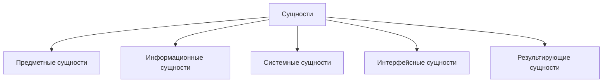
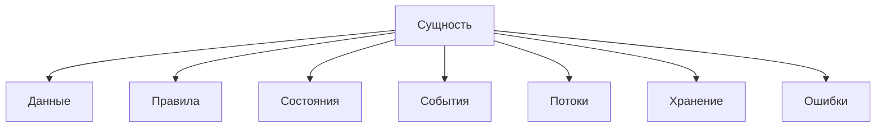

# Entities / Сущности

## 1. Назначение документа

`Entities.md` раскрывает понятие сущности при проектировании цифровых систем.

Документ используется как энциклопедическая статья и как опорный материал для roadmap-документов, анкет и примеров.

Документ не является roadmap-документом. Документ объясняет понятие, классификацию и применение сущностей.

## 2. Место документа в системе знаний

Документ относится к энциклопедическому слою проекта Programming Digital Systems.

Документ используется при проектировании системы до формирования технических требований.

Сущности являются одним из первых объектов анализа, потому что через них проектировщик определяет, что существует в системе и вокруг неё.

## 3. DEF-ENT-001. Определение сущности

Сущность — это значимый объект предметной области, системы, данных, интерфейса или результата, который необходимо учитывать при проектировании цифровой системы.

Сущность считается выделенной корректно, если для неё можно определить:

- название;
- назначение;
- тип;
- данные или атрибуты;
- связи с другими сущностями;
- правила поведения или ограничения;
- роль в системе.

## 4. Зачем выделять сущности

Сущности нужны для того, чтобы проектировщик мог:

- понять состав системы;
- отделить реальные объекты от информационных моделей;
- определить данные;
- определить связи;
- определить правила;
- определить состояния;
- определить события;
- подготовить структуру хранения;
- подготовить архитектуру реализации.

Если сущности не выделены, система проектируется хаотично.

## 5. Основные виды сущностей

### 5.1. Предметные сущности

Предметные сущности описывают объекты реального или бизнес-процесса, ради которого создаётся система.

Примеры:

- Скрипт автоматизации
  - Деталь.
  - Материал.
  - Заказ.
  - Файл обработки.
- GUI-приложение
  - Пользователь.
  - Проект.
  - Настройка.
- Embedded-система
  - Датчик.
  - Клапан.
  - Контролируемый узел.
- PLC-система
  - Привод.
  - Насос.
  - Аварийная зона.
  - Технологический агрегат.
- CNC/CAM-система
  - Инструмент.
  - Операция обработки.
  - Постпроцессор.
  - NC-программа.

### 5.2. Информационные сущности

Информационные сущности описывают данные, документы, записи и цифровые представления предметных объектов.

Примеры:

- Скрипт автоматизации
  - Excel-строка.
  - JSON-запись.
  - PDF-документ.
- GUI-приложение
  - Форма ввода.
  - Профиль настроек.
  - Состояние окна.
- Embedded-система
  - Пакет измерений.
  - Буфер данных.
  - Конфигурационная запись.
- PLC-система
  - Тег.
  - Data Block.
  - Журнал аварий.
- CNC/CAM-система
  - Таблица инструмента.
  - Файл параметров постпроцессора.
  - Запись времени обработки.

### 5.3. Системные сущности

Системные сущности описывают внутренние элементы самой цифровой системы.

Примеры:

- Модуль.
- Компонент.
- Сервис.
- Контроллер.
- Обработчик.
- Репозиторий данных.
- Конфигурация.
- Очередь задач.
- Состояние выполнения.

### 5.4. Интерфейсные сущности

Интерфейсные сущности описывают объекты взаимодействия пользователя, внешней системы или оборудования с цифровой системой.

Примеры:

- Кнопка.
- Поле ввода.
- Команда.
- API endpoint.
- Сообщение.
- Экран.
- HMI-страница.
- Сигнал входа.
- Сигнал выхода.

### 5.5. Результирующие сущности

Результирующие сущности описывают то, что система создаёт, изменяет или выдаёт после обработки.

Примеры:

- Отчёт.
- Лог.
- Выходной файл.
- Команда управления.
- Обновлённая запись.
- Сформированная программа.
- Предупреждение.
- Диагностическое сообщение.

## 6. DG-ENT-001. Общая классификация сущностей

Назначение: показать основные виды сущностей при проектировании цифровой системы.

Пояснение: диаграмма показывает верхний уровень классификации. Конкретная система может содержать не все виды сущностей, но проектировщик должен проверить каждый вид.

## 7. Правила выделения сущностей

### RULE-ENT-001. Сущность должна иметь смысловую роль

Сущность допускается в модель только если она влияет на данные, правила, состояние, события, потоки, хранение, интерфейс или результат.

### RULE-ENT-002. Сущность должна иметь границу ответственности

Для каждой сущности необходимо определить, за что она отвечает и за что не отвечает.

### RULE-ENT-003. Сущность не должна быть случайным техническим словом

Нельзя выделять сущность только потому, что слово встречается в описании проекта.

### RULE-ENT-004. Сущность не должна смешивать объект и действие

Неправильно:

- `Обработка файла` как сущность.

Правильно:

- `Файл` как сущность.
- `Обработка файла` как процесс или поток.

### RULE-ENT-005. Сущность должна быть проверяема вопросами

Для каждой сущности необходимо ответить:

- Что это?
- Зачем это нужно системе?
- Какие данные описывают сущность?
- С какими сущностями она связана?
- Какие правила на неё действуют?
- Может ли она иметь состояния?
- Какие события могут её изменить?

## 8. Связь сущностей с другими понятиями

Пояснение: сущность является точкой входа в дальнейшее проектирование. После выделения сущностей необходимо определить данные, правила, состояния, события, потоки, хранение и ошибки.

## 9. Примеры применения

### 9.1. Скрипт автоматизации

Контекст: скрипт анализирует Excel-файлы и формирует отчёт.

Сущности:

- Входной файл.
- Строка таблицы.
- Деталь.
- Материал.
- Отчёт.
- Ошибка обработки.

### 9.2. GUI-приложение

Контекст: пользователь редактирует шаблон документа.

Сущности:

- Пользователь.
- Проект.
- Шаблон.
- Поле шаблона.
- Настройка.
- Предпросмотр.

### 9.3. Embedded-система

Контекст: контроллер управляет клапаном по данным датчика.

Сущности:

- Датчик.
- Клапан.
- Контроллер.
- Измерение.
- Команда управления.
- Аварийное состояние.

### 9.4. PLC-система

Контекст: PLC управляет насосной системой.

Сущности:

- Насос.
- Датчик уровня.
- Режим работы.
- Авария.
- Команда оператора.
- Межблокировка.

### 9.5. CNC/CAM-система

Контекст: система анализирует NC-программы и инструмент.

Сущности:

- Инструмент.
- Операция.
- NC-программа.
- Деталь.
- Постпроцессор.
- Время обработки.

## 10. Контрольные вопросы

Перед переходом к данным необходимо ответить:

1. Какие предметные сущности существуют в системе?
2. Какие информационные сущности нужны для работы системы?
3. Какие системные сущности появляются внутри цифрового решения?
4. Какие интерфейсные сущности обеспечивают взаимодействие?
5. Какие результирующие сущности создаёт система?
6. Для каждой сущности определена роль?
7. Для каждой сущности можно определить данные?
8. Для каждой сущности понятны связи с другими сущностями?

## 11. Критерии завершения работы с сущностями

Работа с сущностями считается завершённой, если:

- выделены основные виды сущностей;
- для каждой сущности указано назначение;
- сущности не смешаны с процессами и действиями;
- для каждой сущности можно определить данные;
- для каждой сущности можно определить связи;
- открытые вопросы вынесены отдельно;
- список сущностей может быть использован в `docs/05_encyclopedia/Data.md` и `docs/03_roadmaps/01_01_Roadmap_System_Design.md`.

## 12. Связанные документы

### Входные документы

- `PROJECT_SCOPE.md`
  - Передаёт: центральную формулу цифровой системы и области применения.
  - Используется для: определения универсального значения сущностей.
  - Ограничение: не классифицирует сущности подробно.

- `docs/00_maps/00_00_Knowledge_Layer_Map.md`
  - Передаёт: место энциклопедического слоя в базе знаний.
  - Используется для: определения роли статьи `Entities.md`.
  - Ограничение: не раскрывает само понятие сущности.

### Выходные документы

- `docs/05_encyclopedia/Data.md`
  - Получает: список сущностей как основу для определения данных.
  - Используется для: описания данных, атрибутов и информационных структур.
  - Ограничение: не должен заново классифицировать сущности.

- `docs/03_roadmaps/01_01_Roadmap_System_Design.md`
  - Получает: правила выделения сущностей.
  - Используется для: проектирования состава системы.
  - Ограничение: должен использовать сущности как этап проектирования, а не как свободную теорию.
