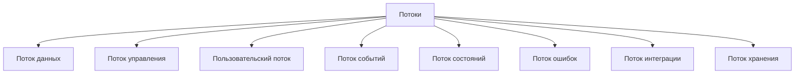
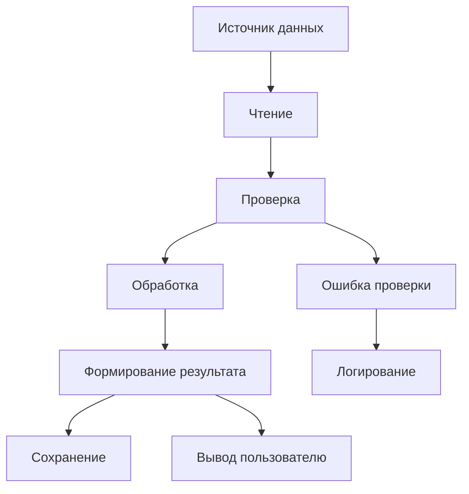
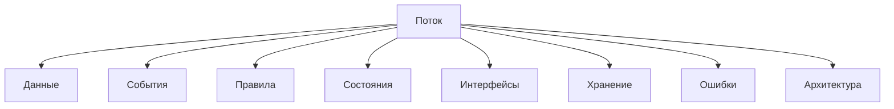

# Flows / Потоки

## 1. Назначение документа

`Flows.md` раскрывает понятие потока при проектировании цифровых систем.

Документ используется как энциклопедическая статья и как опорный материал для roadmap-документов, анкет, технических требований, архитектуры системы, диаграмм и примеров.

Документ не является roadmap-документом. Документ объясняет, какие виды потоков существуют, как их выделять и как связывать с данными, событиями, правилами, состояниями, интерфейсами, хранением и ошибками.

## 2. Место документа в системе знаний

Документ относится к энциклопедическому слою проекта Programming Digital Systems.

Документ используется после `docs/05_encyclopedia/Events.md`.

Потоки определяются после событий, потому что события часто запускают движение данных, команд, состояний, ошибок и сообщений между частями системы.

## 3. DEF-FLOW-001. Определение потока

Поток — это направленное движение данных, команд, событий, управления, ошибок, состояний или сообщений между участниками, модулями, слоями, устройствами, файлами, интерфейсами или внешними системами.

Поток считается определённым корректно, если для него указаны:

- источник;
- получатель;
- что передаётся;
- причина запуска;
- условие выполнения;
- порядок шагов;
- результат;
- возможные ошибки;
- связь с правилами, состояниями и событиями.

## 4. Зачем определять потоки

Потоки нужно определять для того, чтобы проектировщик мог:

- понять, как информация проходит через систему;
- определить порядок обработки;
- определить взаимодействие модулей;
- определить взаимодействие пользователя и системы;
- определить взаимодействие с внешними системами;
- определить места ошибок;
- определить точки логирования;
- подготовить архитектуру системы;
- подготовить sequence diagram, flowchart и тестовые сценарии.

Если потоки не определены, система может иметь неявные связи, скрытые зависимости и непроверяемое поведение.

## 5. Основные виды потоков

### 5.1. Поток данных

Поток данных описывает движение данных от источника к обработке, хранению или результату.

Примеры:

- Файл → чтение → парсинг → проверка → обработка → отчёт.
- Датчик → фильтрация → расчёт → команда управления.
- API-запрос → проверка → бизнес-логика → ответ.

### 5.2. Поток управления

Поток управления описывает порядок команд, решений и вызовов между частями системы.

Примеры:

- Пользователь нажимает кнопку → сценарий запускает обработку → модуль обработки вызывает модуль сохранения.
- PLC получает команду → проверяет межблокировки → запускает привод.

### 5.3. Пользовательский поток

Пользовательский поток описывает путь пользователя через интерфейс или сценарий работы.

Примеры:

- Открыть файл → проверить данные → запустить обработку → посмотреть результат → сохранить отчёт.
- Открыть шаблон → изменить поле → проверить предпросмотр → экспортировать файл.

### 5.4. Поток событий

Поток событий описывает последовательность событий и реакций системы.

Примеры:

- `FileSelected` → `ValidationStarted` → `ValidationCompleted` → `ProcessingStarted` → `ProcessingCompleted`.
- `SensorChanged` → `ThresholdExceeded` → `ValveCommandCreated`.

### 5.5. Поток состояний

Поток состояний описывает переходы между состояниями системы, сущности, процесса или оборудования.

Примеры:

- `idle` → `validating` → `processing` → `completed`.
- `ready` → `running` → `fault` → `safe_state`.

### 5.6. Поток ошибок

Поток ошибок описывает путь возникновения, обработки, логирования и отображения ошибки.

Примеры:

- Ошибка чтения файла → запись в лог → сообщение пользователю → остановка обработки.
- Потеря сигнала → аварийное состояние → блокировка команды → сообщение HMI.

### 5.7. Поток интеграции

Поток интеграции описывает обмен между системой и внешними системами.

Примеры:

- GUI → REST API → база данных → ответ GUI.
- PLC → HMI → оператор → PLC.
- Excel → скрипт → JSON → база данных.

### 5.8. Поток хранения

Поток хранения описывает движение данных в систему хранения и обратно.

Примеры:

- Данные обработки → сериализация → файл результата.
- Измерение → проверка → запись в базу → чтение для отчёта.

## 6. DG-FLOW-001. Общая классификация потоков

Назначение: показать основные виды потоков в цифровой системе.

## 7. DG-FLOW-002. Типовой поток обработки данных

Назначение: показать типовой путь данных через цифровую систему.

## 8. Правила выделения потоков

### RULE-FLOW-001. Поток должен иметь источник и получатель

Нельзя описывать поток без точки начала и точки завершения.

### RULE-FLOW-002. Поток должен определять, что передаётся

Необходимо определить, что движется по потоку:

- данные;
- команда;
- событие;
- состояние;
- ошибка;
- сообщение;
- результат.

### RULE-FLOW-003. Поток должен иметь причину запуска

Необходимо определить, какое событие, действие или условие запускает поток.

### RULE-FLOW-004. Поток должен иметь порядок шагов

Если поток состоит из нескольких действий, порядок должен быть описан явно.

### RULE-FLOW-005. Поток должен содержать обработку ошибок

Для критичных потоков необходимо определить, что происходит при ошибке.

### RULE-FLOW-006. Поток не должен скрывать зависимость

Если один модуль, слой или система зависит от другого через поток, эта зависимость должна быть явной.

## 9. Связь потоков с другими понятиями

Пояснение: поток показывает движение между элементами системы и помогает выявлять архитектурные границы, интерфейсы, зависимости и места ошибок.

## 10. Примеры применения

### 10.1. Скрипт автоматизации

Контекст: скрипт анализирует файлы и формирует отчёт.

Потоки:

- Поток данных
  - Папка → поиск файлов → чтение → парсинг → проверка → расчёт → отчёт.
- Поток ошибок
  - Ошибка чтения → лог → пропуск файла или остановка обработки.
- Поток хранения
  - Результат обработки → JSON → последующее использование другим скриптом.

### 10.2. GUI-приложение

Контекст: пользователь редактирует шаблон и экспортирует результат.

Потоки:

- Пользовательский поток
  - Открыть шаблон → изменить элемент → проверить предпросмотр → сохранить → экспортировать.
- Поток событий
  - `FieldChanged` → обновление модели → обновление предпросмотра.
- Поток ошибок
  - Ошибка шаблона → подсветка поля → блокировка экспорта.

### 10.3. Embedded-система

Контекст: контроллер управляет клапаном по данным датчика.

Потоки:

- Поток данных
  - Датчик → фильтрация → расчёт → решение.
- Поток управления
  - Решение → команда → исполнительный механизм.
- Поток ошибок
  - Некорректное значение датчика → безопасное состояние → диагностика.

### 10.4. PLC-система

Контекст: PLC управляет технологическим процессом.

Потоки:

- Поток сигналов
  - Входной сигнал → логика межблокировок → команда выходу.
- Поток состояний
  - `manual` → `auto` → `running` → `alarm`.
- Поток ошибок
  - Аварийный вход → аварийное состояние → сообщение HMI → подтверждение оператора.

### 10.5. CNC/CAM-система

Контекст: система анализирует NC-программы и инструмент.

Потоки:

- Поток данных
  - NC-файл → парсинг → поиск инструмента → расчёт времени → отчёт.
- Поток интеграции
  - Таблица Excel → анализатор → CSV/JSON → база данных или отчёт.
- Поток ошибок
  - Неизвестный формат программы → лог → ручная проверка.

## 11. Контрольные вопросы

Перед переходом к хранению необходимо ответить:

1. Какие потоки данных существуют?
2. Какие потоки управления существуют?
3. Какие пользовательские потоки существуют?
4. Какие потоки событий существуют?
5. Какие потоки состояний существуют?
6. Какие потоки ошибок существуют?
7. Какие интеграционные потоки существуют?
8. Какие потоки хранения существуют?
9. Для каждого важного потока указан источник?
10. Для каждого важного потока указан получатель?
11. Для каждого важного потока указано, что передаётся?
12. Для каждого критичного потока указана обработка ошибок?

## 12. Критерии завершения работы с потоками

Работа с потоками считается завершённой, если:

- потоки разделены по видам;
- для каждого важного потока указан источник;
- для каждого важного потока указан получатель;
- для каждого важного потока указано, что передаётся;
- для каждого важного потока указан запуск;
- для критичных потоков определена обработка ошибок;
- потоки связаны с данными, событиями, правилами и состояниями;
- потоки могут быть использованы в архитектуре системы;
- открытые вопросы вынесены отдельно.

## 13. Связанные документы

### Входные документы

- `docs/05_encyclopedia/Data.md`
  - Передаёт: виды данных, которые могут двигаться по потокам.
  - Используется для: определения потоков данных и хранения.
  - Ограничение: не описывает маршруты движения данных.

- `docs/05_encyclopedia/Rules.md`
  - Передаёт: правила обработки и проверки.
  - Используется для: определения условий выполнения потоков.
  - Ограничение: не описывает порядок шагов потока.

- `docs/05_encyclopedia/States.md`
  - Передаёт: состояния и переходы.
  - Используется для: определения потоков состояний.
  - Ограничение: не описывает потоки данных и управления.

- `docs/05_encyclopedia/Events.md`
  - Передаёт: события как точки запуска потоков.
  - Используется для: определения потоков событий и запуска обработки.
  - Ограничение: не описывает полный маршрут обработки.

### Выходные документы

- `docs/05_encyclopedia/Storage.md`
  - Получает: потоки хранения и данные, которые нужно сохранять.
  - Используется для: определения хранения данных.
  - Ограничение: не должен заново описывать все потоки.

- `docs/05_encyclopedia/Errors.md`
  - Получает: потоки ошибок и места возникновения ошибок.
  - Используется для: описания ошибок и реакции системы.
  - Ограничение: не должен подменять поток обработки.

- `docs/03_roadmaps/01_01_Roadmap_System_Design.md`
  - Получает: правила выделения потоков.
  - Используется для: проектирования движения данных, событий, управления и ошибок.
  - Ограничение: не должен смешивать потоки с архитектурной реализацией.

- `docs/03_roadmaps/02_02_Roadmap_System_Architecture_Design.md`
  - Получает: потоки как основу для модулей, интерфейсов, зависимостей и слоёв.
  - Используется для: проектирования архитектуры системы.
  - Ограничение: не должен выбирать конкретные библиотеки реализации.
