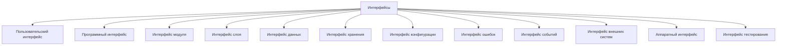
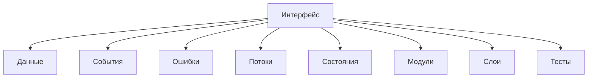

# Interfaces / Интерфейсы

## 1. Назначение документа

`Interfaces.md` раскрывает понятие интерфейса при проектировании цифровых систем.

Документ используется как энциклопедическая статья и как опорный материал для roadmap-документов, анкет, технических требований, архитектуры системы, архитектуры реализации и примеров.

Документ не является roadmap-документом. Документ объясняет, какие виды интерфейсов существуют, как их выделять, описывать и связывать с данными, событиями, состояниями, ошибками, потоками и архитектурой.

## 2. Место документа в системе знаний

Документ относится к энциклопедическому слою проекта Programming Digital Systems.

Документ используется после `docs/05_encyclopedia/Errors.md`.

Интерфейсы определяются после данных, потоков и ошибок, потому что интерфейс должен описывать, что передаётся через границу, какие действия допустимы и какие ошибки должны быть возвращены или показаны.

## 3. DEF-INT-001. Определение интерфейса

Интерфейс — это граница взаимодействия между пользователем, системой, модулем, слоем, внешней системой, устройством, данными или средой выполнения.

Интерфейс считается определённым корректно, если для него указаны:

- участники взаимодействия;
- назначение;
- входные данные;
- выходные данные;
- допустимые команды или действия;
- правила проверки;
- ошибки взаимодействия;
- формат обмена;
- ограничения;
- ответственность каждой стороны.

## 4. Зачем определять интерфейсы

Интерфейсы нужно определять для того, чтобы проектировщик мог:

- отделить внутреннюю реализацию от внешнего взаимодействия;
- определить границы модулей и слоёв;
- определить обмен данными;
- определить команды и события;
- определить ошибки взаимодействия;
- подготовить архитектуру системы;
- подготовить технические требования;
- обеспечить тестируемость системы.

Если интерфейсы не определены, система получает скрытые зависимости и неясные границы ответственности.

## 5. Основные виды интерфейсов

### 5.1. Пользовательский интерфейс

Пользовательский интерфейс определяет взаимодействие человека с системой.

Примеры:

- GUI-окно.
- Форма ввода.
- Кнопка.
- HMI-экран.
- Командная строка.
- Сообщение пользователю.

### 5.2. Программный интерфейс

Программный интерфейс определяет взаимодействие между программами или компонентами через формальный контракт.

Примеры:

- REST API.
- CLI-команда.
- Python-функция.
- SDK.
- Сервисный метод.

### 5.3. Интерфейс модуля

Интерфейс модуля определяет, как другие части системы используют модуль.

Примеры:

- Функции модуля парсинга.
- Методы сервиса обработки.
- Контракт репозитория данных.
- Вход и выход валидатора.

### 5.4. Интерфейс слоя

Интерфейс слоя определяет допустимое взаимодействие между архитектурными слоями.

Примеры:

- Слой представления вызывает только слой сценариев приложения.
- Доменный слой не зависит от инфраструктуры.
- Слой хранения предоставляет операции чтения и записи через абстракцию.

### 5.5. Интерфейс данных

Интерфейс данных определяет формат, структуру и правила передачи данных.

Примеры:

- JSON-схема.
- CSV-структура.
- DTO.
- Формат сообщения.
- Табличная структура.

### 5.6. Интерфейс хранения

Интерфейс хранения определяет, как система читает, записывает, обновляет и удаляет данные.

Примеры:

- Repository interface.
- File storage contract.
- Database access layer.
- Configuration storage interface.

### 5.7. Интерфейс конфигурации

Интерфейс конфигурации определяет, как система получает и проверяет настройки.

Примеры:

- Конфигурационный файл.
- Переменные окружения.
- Экран настроек.
- Параметры запуска.

### 5.8. Интерфейс ошибок

Интерфейс ошибок определяет, как ошибки передаются пользователю, оператору, модулю, внешней системе или журналу.

Примеры:

- Сообщение в GUI.
- Код ошибки API.
- Запись в лог.
- Аварийное сообщение HMI.
- Исключение модуля.

### 5.9. Интерфейс событий

Интерфейс событий определяет формат и правила передачи событий.

Примеры:

- Event object.
- Message queue event.
- Callback.
- PLC-сигнал.
- UI event.

### 5.10. Интерфейс внешних систем

Интерфейс внешних систем определяет взаимодействие с программами, сервисами, оборудованием или промышленными системами вне текущей системы.

Примеры:

- API внешнего сервиса.
- Обмен с PLC.
- Обмен с HMI.
- Импорт из Excel.
- Экспорт в ERP.
- Чтение NC-файла.

### 5.11. Аппаратный интерфейс

Аппаратный интерфейс определяет взаимодействие с физическими устройствами.

Примеры:

- GPIO.
- I2C.
- SPI.
- UART.
- Аналоговый вход.
- Дискретный вход PLC.
- Сигнал привода.

### 5.12. Интерфейс тестирования

Интерфейс тестирования определяет, как система или модуль проверяется.

Примеры:

- Тестовая функция.
- Mock-интерфейс.
- Симулятор оборудования.
- Тестовый API.
- Фикстура данных.

## 6. DG-INT-001. Общая классификация интерфейсов

Назначение: показать основные виды интерфейсов в цифровой системе.

## 7. Правила анализа интерфейсов

### RULE-INT-001. Интерфейс должен иметь участников

Необходимо определить, кто взаимодействует через интерфейс.

### RULE-INT-002. Интерфейс должен иметь контракт

Контракт должен определять входные данные, выходные данные, допустимые действия и ошибки.

### RULE-INT-003. Интерфейс должен скрывать внутреннюю реализацию

Пользователь интерфейса не должен зависеть от внутренних деталей реализации.

### RULE-INT-004. Интерфейс должен быть стабильнее реализации

Внутренняя реализация может меняться чаще, чем внешний контракт интерфейса.

### RULE-INT-005. Ошибки интерфейса должны быть определены явно

Нельзя проектировать интерфейс без ошибок и недопустимых сценариев.

### RULE-INT-006. Интерфейс не должен иметь лишнюю ответственность

Интерфейс должен выполнять свою роль и не должен превращаться в универсальную точку доступа ко всей системе.

## 8. Связь интерфейсов с другими понятиями

Пояснение: интерфейс является границей, через которую проходят данные, события, ошибки и команды между частями системы.

## 9. Примеры применения

### 9.1. Скрипт автоматизации

Интерфейсы:

- CLI-интерфейс запуска.
- Интерфейс чтения Excel-файла.
- Интерфейс чтения PDF-файла.
- Интерфейс записи отчёта.
- Интерфейс логирования.

### 9.2. GUI-приложение

Интерфейсы:

- Пользовательский интерфейс окна.
- Интерфейс сценариев приложения.
- Интерфейс сохранения проекта.
- Интерфейс экспорта.
- Интерфейс сообщений об ошибках.

### 9.3. Embedded-система

Интерфейсы:

- Интерфейс датчика.
- Интерфейс исполнительного механизма.
- Интерфейс конфигурации.
- Диагностический интерфейс.
- Интерфейс связи.

### 9.4. PLC-система

Интерфейсы:

- Дискретные входы.
- Дискретные выходы.
- HMI-интерфейс.
- Интерфейс аварий.
- Интерфейс межблокировок.

### 9.5. CNC/CAM-система

Интерфейсы:

- Интерфейс NC-файла.
- Интерфейс таблицы инструмента.
- Интерфейс постпроцессора.
- Интерфейс отчёта.
- Интерфейс внешней базы данных.

## 10. Контрольные вопросы

Перед переходом к архитектуре необходимо ответить:

1. Какие пользовательские интерфейсы нужны системе?
2. Какие программные интерфейсы нужны системе?
3. Какие интерфейсы модулей нужны системе?
4. Какие интерфейсы слоёв нужны системе?
5. Какие интерфейсы данных нужны системе?
6. Какие интерфейсы хранения нужны системе?
7. Какие интерфейсы конфигурации нужны системе?
8. Какие интерфейсы ошибок нужны системе?
9. Какие интерфейсы событий нужны системе?
10. Какие интерфейсы внешних систем нужны системе?
11. Какие аппаратные интерфейсы нужны системе?
12. Какие интерфейсы тестирования нужны системе?
13. Для каждого интерфейса определён вход?
14. Для каждого интерфейса определён выход?
15. Для каждого интерфейса определены ошибки?

## 11. Критерии завершения работы с интерфейсами

Работа с интерфейсами считается завершённой, если:

- интерфейсы разделены по видам;
- для каждого важного интерфейса указаны участники;
- для каждого важного интерфейса указан контракт;
- для каждого важного интерфейса указаны входные данные;
- для каждого важного интерфейса указаны выходные данные;
- для каждого важного интерфейса указаны ошибки;
- интерфейсы связаны с потоками, событиями, данными и архитектурой;
- интерфейсы могут быть использованы при проектировании архитектуры системы и технических требований.

## 12. Связанные документы

### Входные документы

- `docs/05_encyclopedia/Data.md`
  - Передаёт: данные, проходящие через интерфейсы.
  - Используется для: определения входных и выходных данных интерфейса.
  - Ограничение: не описывает границы взаимодействия.

- `docs/05_encyclopedia/Events.md`
  - Передаёт: события, которые могут проходить через интерфейсы.
  - Используется для: проектирования интерфейсов событий.
  - Ограничение: не описывает контракты интерфейсов.

- `docs/05_encyclopedia/Errors.md`
  - Передаёт: ошибки, которые должны быть показаны, возвращены или залогированы через интерфейс.
  - Используется для: определения интерфейсов ошибок.
  - Ограничение: не определяет все виды интерфейсов.

- `docs/05_encyclopedia/Flows.md`
  - Передаёт: движение данных, команд, событий и ошибок.
  - Используется для: определения границ взаимодействия.
  - Ограничение: не определяет контракт интерфейса.

### Выходные документы

- `docs/05_encyclopedia/Architecture.md`
  - Получает: интерфейсы как границы между слоями, модулями и внешними системами.
  - Используется для: объяснения архитектурной организации системы.
  - Ограничение: не должен заново классифицировать интерфейсы.

- `docs/03_roadmaps/02_02_Roadmap_System_Architecture_Design.md`
  - Получает: правила анализа интерфейсов.
  - Используется для: проектирования архитектуры системы.
  - Ограничение: не должен выбирать конкретную библиотеку реализации интерфейса.
