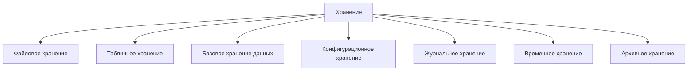
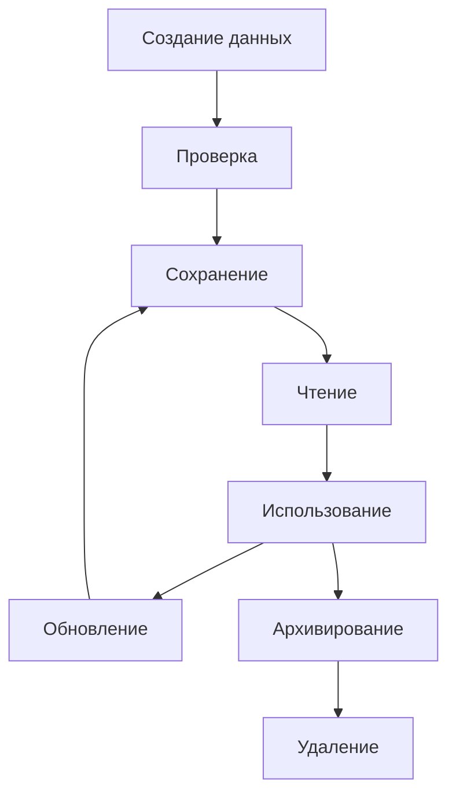

# Storage / Хранение

## 1. Назначение документа

`Storage.md` раскрывает понятие хранения при проектировании цифровых систем.

Документ используется как энциклопедическая статья и как опорный материал для roadmap-документов, анкет, технических требований, архитектуры системы и примеров.

Документ не является roadmap-документом. Документ объясняет, какие виды хранения существуют, какие данные нужно сохранять, как определять жизненный цикл хранимых данных и какие требования должны быть сформированы до выбора конкретного инструмента хранения.

## 2. Место документа в системе знаний

Документ относится к энциклопедическому слою проекта Programming Digital Systems.

Документ используется после `docs/05_encyclopedia/Flows.md`.

Хранение определяется после потоков, потому что сначала необходимо понять, какие данные движутся через систему, какие данные являются временными, а какие должны сохраняться между запусками или передаваться другим системам.

## 3. DEF-STOR-001. Определение хранения

Хранение — это организованный способ сохранения данных, состояния, конфигурации, журналов, результатов, истории изменений или справочной информации так, чтобы система могла использовать эти данные позже.

Хранение считается определённым корректно, если для него указаны:

- что сохраняется;
- зачем сохраняется;
- кто создаёт данные;
- кто использует данные;
- срок жизни данных;
- правило обновления;
- правило удаления или архивирования;
- требования к целостности;
- требования к доступу;
- действие при ошибке хранения.

## 4. Зачем определять хранение

Хранение нужно определять для того, чтобы проектировщик мог:

- отделить временные данные от постоянных;
- определить, какие данные нужны после перезапуска системы;
- определить, какие данные нужны для отчётов;
- определить, какие данные нужны для аудита и диагностики;
- определить требования к целостности данных;
- определить требования к резервному копированию;
- определить требования к миграции данных;
- подготовить технические требования к выбору инструмента хранения.

Если хранение не определено, система может терять важные данные или сохранять лишние данные без причины.

## 5. Основные виды хранения

### 5.1. Файловое хранение

Файловое хранение используется для сохранения данных в файлах.

Примеры:

- JSON-файл результата.
- CSV-отчёт.
- TXT-лог.
- XML-конфигурация.
- NC-программа.

### 5.2. Табличное хранение

Табличное хранение используется для данных, которые удобно представлять строками и столбцами.

Примеры:

- Excel-таблица.
- CSV-файл.
- Таблица базы данных.
- Журнал измерений.

### 5.3. Базовое хранение данных

Базовое хранение данных используется для структурированных данных с отношениями, поиском и обновлением.

Примеры:

- База деталей.
- База инструментов.
- Складской учёт.
- История измерений.

### 5.4. Конфигурационное хранение

Конфигурационное хранение используется для параметров, которые управляют поведением системы без изменения кода.

Примеры:

- Пути к папкам.
- Пороги предупреждений.
- Список допустимых материалов.
- Настройки интерфейса.
- Параметры подключения.

### 5.5. Журнальное хранение

Журнальное хранение используется для фиксации событий, ошибок, действий пользователя и технической диагностики.

Примеры:

- Лог обработки.
- Журнал ошибок.
- Журнал действий пользователя.
- Журнал аварий PLC.
- Журнал измерений инструмента.

### 5.6. Временное хранение

Временное хранение используется для данных, которые нужны только во время выполнения процесса.

Примеры:

- Кэш.
- Буфер.
- Временный список.
- Промежуточный результат расчёта.

### 5.7. Архивное хранение

Архивное хранение используется для данных, которые больше не участвуют в текущей работе, но должны быть сохранены для истории, аудита или анализа.

Примеры:

- Старые отчёты.
- История заказов.
- Архив логов.
- Старые версии конфигурации.

## 6. DG-STOR-001. Общая классификация хранения

Назначение: показать основные виды хранения в цифровой системе.

## 7. Правила анализа хранения

### RULE-STOR-001. Хранение должно иметь назначение

Нельзя сохранять данные без объяснения, зачем они нужны после текущей операции.

### RULE-STOR-002. Хранимые данные должны иметь владельца

Необходимо определить, какой модуль, слой, пользователь или внешняя система создаёт и использует данные.

### RULE-STOR-003. Хранение должно иметь жизненный цикл

Для хранимых данных необходимо определить:

- когда данные создаются;
- когда данные читаются;
- когда данные изменяются;
- когда данные архивируются;
- когда данные удаляются.

### RULE-STOR-004. Хранение должно иметь правило целостности

Необходимо определить, какие данные не должны быть потеряны, дублированы, повреждены или сохранены в противоречивом состоянии.

### RULE-STOR-005. Хранение не должно смешиваться с выбором инструмента

Неправильно:

> Использовать SQLite.

Правильно:

> Система должна сохранять данные между запусками в структурированном виде с возможностью поиска по ключевым полям.

Выбор SQLite, PostgreSQL, JSON, CSV или другого инструмента относится к Roadmap выбора инструментария.

## 8. DG-STOR-002. Жизненный цикл хранимых данных

## 9. Примеры применения

### 9.1. Скрипт автоматизации

Хранение:

- JSON-файл результата.
- Лог обработки.
- CSV-отчёт.
- Конфигурационный файл путей.

### 9.2. GUI-приложение

Хранение:

- Пользовательские настройки.
- Шаблоны.
- Последний открытый проект.
- История экспорта.

### 9.3. Embedded-система

Хранение:

- Конфигурация устройства.
- Последнее состояние.
- Диагностический журнал.
- Калибровочные параметры.

### 9.4. PLC-система

Хранение:

- Retain-переменные.
- Журнал аварий.
- Уставки оператора.
- Счётчики циклов.

### 9.5. CNC/CAM-система

Хранение:

- Таблица инструмента.
- История использования инструмента.
- Архив NC-программ.
- Журнал измерений.

## 10. Контрольные вопросы

Перед переходом к ошибкам необходимо ответить:

1. Какие данные должны сохраняться между запусками?
2. Какие данные являются временными?
3. Какие данные являются конфигурационными?
4. Какие данные являются журнальными?
5. Какие данные нужно архивировать?
6. Для каждого вида хранения указано назначение?
7. Для каждого вида хранения указан владелец?
8. Для каждого вида хранения указан жизненный цикл?
9. Какие ошибки хранения возможны?
10. Какие требования к целостности данных существуют?

## 11. Критерии завершения работы с хранением

Работа с хранением считается завершённой, если:

- определены все данные, которые нужно сохранять;
- временные данные отделены от постоянных;
- конфигурационные данные выделены отдельно;
- журнальные данные выделены отдельно;
- определён жизненный цикл хранимых данных;
- определены требования к целостности;
- определены возможные ошибки хранения;
- выбор конкретного инструмента хранения не смешан с требованиями к хранению.

## 12. Связанные документы

### Входные документы

- `docs/05_encyclopedia/Data.md`
  - Передаёт: виды данных и жизненный цикл данных.
  - Используется для: определения хранимых данных.
  - Ограничение: не описывает хранение как отдельную ответственность.

- `docs/05_encyclopedia/Flows.md`
  - Передаёт: потоки хранения и движение данных.
  - Используется для: определения моментов сохранения, чтения и архивирования.
  - Ограничение: не определяет правила целостности хранения.

### Выходные документы

- `docs/05_encyclopedia/Errors.md`
  - Получает: возможные ошибки хранения.
  - Используется для: описания реакции на ошибки записи, чтения, целостности и доступа.
  - Ограничение: не должен выбирать инструмент хранения.

- `docs/03_roadmaps/01_01_01_Roadmap_System_Design.md`
  - Получает: правила анализа хранения.
  - Используется для: проектирования хранения системы.
  - Ограничение: не должен смешивать хранение с выбором базы данных или библиотеки.

- `docs/03_roadmaps/03_03_03_Roadmap_Technical_Requirements.md`
  - Получает: требования к хранимым данным, целостности и жизненному циклу.
  - Используется для: формулирования технических требований к хранению.
  - Ограничение: не должен подменять Roadmap выбора инструментария.
