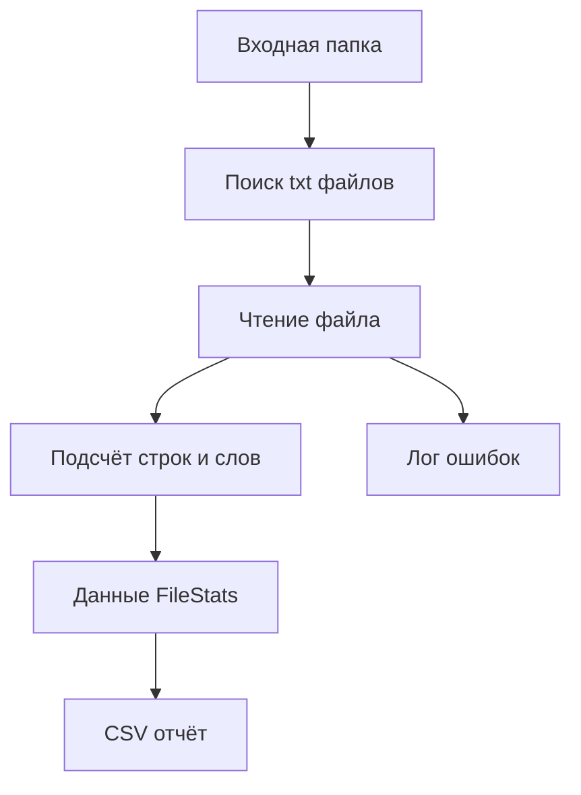

# Example: Python File Processing Utility / Пример Python-утилиты обработки файлов

## 1. Назначение примера

`Python_File_Processing_Utility.md` показывает полный учебный маршрут проектирования простой Python-утилиты для обработки файлов.

Пример нужен для новичка, который хочет научиться не просто писать код, а проектировать небольшую систему правильно:

- от идеи;
- через проектирование системы;
- через архитектуру системы;
- через технические требования;
- через выбор инструментария;
- через архитектуру реализации;
- через тестирование;
- до эксплуатации, сопровождения и развития.

Пример не является готовым production-проектом. Это учебная модель мышления.

## 2. Тип системы

Категория примера:

- Scripts / Скрипты автоматизации.

Тип системы:

- локальная Python-утилита;
- CLI-скрипт;
- файловая обработка;
- без GUI;
- без web;
- без embedded;
- без PLC;
- без CNC/CAM-специализации.

## 3. Идея системы

Идея:

> Создать Python-утилиту, которая читает все `.txt` файлы из входной папки, считает количество строк и слов в каждом файле, формирует общий отчёт в `.csv` и сохраняет лог обработки.

Проблема:

- пользователь вручную открывает много текстовых файлов и считает информацию;
- ручной подсчёт занимает время;
- ручной подсчёт может содержать ошибки;
- результат трудно повторить.

Ожидаемый результат:

- отчёт `report.csv`;
- лог `processing.log`;
- понятные сообщения об ошибках.

## 4. Предметная область

### 4.1. Участники

- Пользователь
  - Запускает утилиту и получает отчёт.

- Файловая система
  - Хранит входные файлы, отчёт и лог.

### 4.2. Объекты предметной области

- Входная папка
  - Папка, где лежат файлы для обработки.

- Текстовый файл
  - Файл с расширением `.txt`.

- Отчёт
  - CSV-файл с результатами обработки.

- Лог
  - Файл с диагностической информацией.

### 4.3. Процессы

- поиск файлов;
- чтение файла;
- подсчёт строк;
- подсчёт слов;
- запись отчёта;
- запись лога.

## 5. Проектирование системы

Связанный roadmap:

- `docs/03_roadmaps/Roadmap_System_Design.md`

### 5.1. Граница системы

Внутри системы:

- поиск `.txt` файлов;
- чтение файлов;
- подсчёт строк и слов;
- формирование отчёта;
- логирование.

Вне системы:

- создание входных файлов пользователем;
- ручное исправление повреждённых файлов;
- анализ отчёта человеком.

### 5.2. Сущности

#### Предметные сущности

- Текстовый файл
  - Объект обработки.

- Отчёт
  - Результат работы системы.

#### Информационные сущности

- FileStats
  - Данные о количестве строк и слов в одном файле.

- ProcessingResult
  - Итог обработки всех файлов.

#### Системные сущности

- FileScanner
  - Ищет входные файлы.

- FileReader
  - Читает содержимое файла.

- StatsCalculator
  - Считает строки и слова.

- ReportWriter
  - Записывает отчёт.

- Logger
  - Фиксирует ход обработки и ошибки.

### 5.3. Данные

#### Входные данные

- путь к входной папке;
- `.txt` файлы.

#### Внутренние данные

- список найденных файлов;
- содержимое файла;
- количество строк;
- количество слов.

#### Выходные данные

- `report.csv`;
- `processing.log`.

#### Конфигурационные данные

- путь к входной папке;
- путь к выходной папке;
- расширение обрабатываемых файлов.

### 5.4. Правила

- Система должна обрабатывать только файлы с расширением `.txt`.
- Если входная папка отсутствует, система должна завершиться с ошибкой.
- Если отдельный файл не удалось прочитать, система должна записать ошибку в лог и продолжить обработку остальных файлов.
- Отчёт должен содержать одну строку на каждый успешно обработанный файл.
- Исходные файлы не должны изменяться.

### 5.5. Состояния

- idle
  - Утилита ещё не запущена.

- scanning
  - Система ищет файлы.

- processing
  - Система обрабатывает файлы.

- writing_report
  - Система записывает отчёт.

- completed
  - Обработка завершена.

- failed
  - Критическая ошибка не позволила выполнить обработку.

### 5.6. События

- start_requested
  - Пользователь запустил утилиту.

- input_folder_missing
  - Входная папка не найдена.

- file_found
  - Найден файл для обработки.

- file_read_failed
  - Файл не удалось прочитать.

- report_written
  - Отчёт сохранён.

### 5.7. Потоки



### 5.8. Хранение

Система сохраняет:

- отчёт `.csv`;
- лог `.log`.

Система не сохраняет:

- содержимое входных файлов;
- внутреннее состояние между запусками.

### 5.9. Ошибки

- входная папка отсутствует;
- нет файлов для обработки;
- файл не удалось прочитать;
- отчёт не удалось записать;
- лог не удалось создать.

## 6. Проектирование архитектуры системы

Связанный roadmap:

- `docs/03_roadmaps/Roadmap_System_Architecture_Design.md`

### 6.1. Слои

- Application Layer
  - Управляет сценарием обработки.

- Domain Layer
  - Содержит модель статистики и правила подсчёта.

- Infrastructure Layer
  - Работает с файловой системой, отчётом и логом.

### 6.2. Модули архитектуры

- ProcessingUseCase
  - Главный сценарий обработки.

- FileDiscoveryService
  - Поиск файлов.

- TextFileReader
  - Чтение файла.

- StatisticsService
  - Подсчёт строк и слов.

- CsvReportService
  - Формирование отчёта.

- LoggingService
  - Запись диагностической информации.

### 6.3. Модели

- FileStats
  - file_name;
  - line_count;
  - word_count;
  - status;
  - error_message.

### 6.4. Интерфейсы

- Reader interface
  - read(path) -> text

- ReportWriter interface
  - write(results, output_path)

- Logger interface
  - info(message)
  - error(message)

### 6.5. Зависимости

Правило:

- Application Layer может использовать Domain Layer и Infrastructure adapters.
- Domain Layer не должен зависеть от файловой системы.
- Infrastructure Layer может зависеть от стандартных библиотек Python.

## 7. Технические требования

Связанный roadmap:

- `docs/03_roadmaps/Roadmap_Technical_Requirements.md`

## REQ-TR-001. Проверка входной папки

### Формулировка

Система должна проверять существование входной папки перед началом обработки.

### Критерий выполнения

Требование выполнено, если при отсутствии входной папки система завершает работу с понятным сообщением об ошибке.

### Способ проверки

- unit-тест;
- ручной запуск с несуществующей папкой.

## REQ-TR-002. Обработка только `.txt` файлов

### Формулировка

Система должна обрабатывать только файлы с расширением `.txt`.

### Критерий выполнения

Требование выполнено, если файлы других форматов игнорируются.

### Способ проверки

- тестовая папка с `.txt`, `.csv`, `.md` файлами.

## REQ-TR-003. Подсчёт строк и слов

### Формулировка

Система должна считать количество строк и слов для каждого успешно прочитанного файла.

### Критерий выполнения

Требование выполнено, если для файла с известным содержимым результат совпадает с ожидаемым.

### Способ проверки

- unit-тест `StatsCalculator`.

## REQ-TR-004. Сохранение отчёта

### Формулировка

Система должна сохранять отчёт в формате CSV.

### Критерий выполнения

Требование выполнено, если после обработки создан файл `report.csv` с колонками `file_name`, `line_count`, `word_count`, `status`, `error_message`.

### Способ проверки

- integration-тест;
- ручная проверка файла.

## REQ-TR-005. Логирование ошибок

### Формулировка

Система должна записывать ошибки обработки в лог.

### Критерий выполнения

Требование выполнено, если ошибка чтения файла фиксируется в `processing.log`.

### Способ проверки

- тест с повреждённым или недоступным файлом.

## 8. Связь требований с инструментарием

Связанный документ:

- `docs/00_maps/Requirements_To_Toolchain_Map.md`

| Требование | Смысл требования | Категория инструмента | Критерий выбора |
|---|---|---|---|
| REQ-TR-001 | Проверить папку перед обработкой | Язык / стандартная библиотека | Должен уметь проверять пути файловой системы |
| REQ-TR-002 | Фильтровать файлы по расширению | Язык / стандартная библиотека | Должен поддерживать обход директорий |
| REQ-TR-003 | Считать строки и слова | Язык программирования | Должен удобно работать со строками |
| REQ-TR-004 | Записывать CSV | Формат файла / библиотека | Должен поддерживать запись CSV |
| REQ-TR-005 | Записывать лог | Логирование | Должен поддерживать запись логов |

## 9. Выбор инструментария

Связанный roadmap:

- `docs/03_roadmaps/Roadmap_Toolchain_Selection.md`

### 9.1. Тип системы

- Скрипт / утилита: Да.
- GUI: Нет.
- Web: Нет.
- Embedded: Нет.
- PLC: Нет.
- CNC/CAM: Нет.

### 9.2. Базовый инструментарий

- Язык программирования:
  - Python.

- Среда выполнения:
  - локальный Python runtime.

- IDE:
  - VS Code или любой редактор.

- Контроль версий:
  - Git.

- Тестирование:
  - pytest.

- Логирование:
  - стандартный модуль `logging`.

- Документация:
  - Markdown.

### 9.3. Прикладной инструментарий

- Форматы файлов:
  - вход: `.txt`;
  - выход: `.csv`;
  - лог: `.log`.

- Библиотеки:
  - `pathlib` для путей;
  - `csv` для отчёта;
  - `logging` для логов.

### 9.4. Специализированный инструментарий

Не применяется.

Причина:

- проект не связан с embedded, PLC, CNC/CAM, промышленной автоматизацией или оборудованием.

## 10. Архитектура реализации

Связанный roadmap:

- `docs/03_roadmaps/Roadmap_Implementation_Architecture.md`

### 10.1. Структура проекта

```text
file_stats_utility/
|-- src/
|   |-- main.py
|   |-- app/
|   |   |-- processing_use_case.py
|   |-- domain/
|   |   |-- models.py
|   |   |-- statistics_service.py
|   |-- infrastructure/
|   |   |-- file_scanner.py
|   |   |-- text_file_reader.py
|   |   |-- csv_report_writer.py
|   |   |-- logging_setup.py
|-- tests/
|   |-- test_statistics_service.py
|   |-- test_file_scanner.py
|   |-- test_processing_use_case.py
|-- examples/
|   |-- input/
|-- docs/
|   |-- usage.md
|-- README.md
```

### 10.2. Назначение директорий

- `src/`
  - Исходный код утилиты.

- `src/app/`
  - Сценарии приложения.

- `src/domain/`
  - Модели и правила предметной логики.

- `src/infrastructure/`
  - Работа с файлами, CSV и логами.

- `tests/`
  - Автоматические тесты.

- `examples/`
  - Пример входных данных.

- `docs/`
  - Инструкция пользователя.

### 10.3. Точка входа

- `src/main.py`
  - Запускает обработку.

### 10.4. Правила зависимостей

- `domain` не зависит от `infrastructure`.
- `app` может использовать `domain` и `infrastructure`.
- `infrastructure` не должна содержать бизнес-правила.

## 11. Кодовая структура без полного кода

Этот пример не обязан сразу содержать полный код.

Главная цель — показать, что код появляется после проектирования.

Минимальный порядок реализации:

1. Создать модель `FileStats`.
2. Реализовать `StatisticsService`.
3. Реализовать поиск файлов.
4. Реализовать чтение файлов.
5. Реализовать запись CSV.
6. Реализовать логирование.
7. Реализовать `ProcessingUseCase`.
8. Подключить `main.py`.
9. Написать тесты.

## 12. Тестирование

Связанный roadmap:

- `docs/03_roadmaps/Roadmap_Testing.md`

### 12.1. Unit-тесты

- `StatisticsService` считает строки и слова правильно.
- `FileScanner` возвращает только `.txt` файлы.

### 12.2. Integration-тесты

- Входная папка → обработка → `report.csv`.
- Файл с ошибкой чтения → ошибка в логе → обработка продолжается.

### 12.3. Тестовые данные

- пустой файл;
- файл с одной строкой;
- файл с несколькими строками;
- файл с пробелами;
- файл другого расширения;
- недоступный файл.

### 12.4. Критерии приёмки

Система готова, если:

- все `.txt` файлы обработаны;
- файлы других форматов проигнорированы;
- отчёт создан;
- ошибки записаны в лог;
- исходные файлы не изменены.

## 13. Эксплуатация

Связанный roadmap:

- `docs/03_roadmaps/Roadmap_Operation.md`

### 13.1. Запуск

Пользователь запускает утилиту и передаёт входную и выходную папку.

Пример команды:

```text
python src/main.py --input examples/input --output output
```

### 13.2. Результат

После запуска пользователь получает:

- `output/report.csv`;
- `output/processing.log`.

### 13.3. Ошибки пользователя

- входная папка отсутствует;
- нет `.txt` файлов;
- нет прав на запись отчёта;
- файл невозможно прочитать.

## 14. Сопровождение

Связанный roadmap:

- `docs/03_roadmaps/Roadmap_Maintenance.md`

### 14.1. Возможные дефекты

- неправильно считается количество слов;
- файл с нестандартной кодировкой не читается;
- отчёт не создаётся при пустой папке;
- лог не содержит нужной диагностики.

### 14.2. Правило сопровождения

Каждый дефект должен иметь:

- файл-пример;
- шаги воспроизведения;
- ожидаемый результат;
- фактический результат;
- тест, который подтверждает исправление.

## 15. Развитие системы

Связанный roadmap:

- `docs/03_roadmaps/Roadmap_System_Evolution.md`

### 15.1. Возможные направления развития

- поддержка `.md` файлов;
- подсчёт символов;
- подсчёт частоты слов;
- GUI-интерфейс;
- сохранение истории отчётов;
- обработка вложенных папок;
- экспорт в JSON;
- настройка правил через конфигурационный файл.

### 15.2. Пример анализа развития

Запрос:

> Добавить обработку вложенных папок.

Анализ влияния:

- данные:
  - путь файла должен сохраняться относительно входной папки;
- правила:
  - нужно определить, обрабатывать ли все подпапки или только выбранные;
- потоки:
  - поиск файлов становится рекурсивным;
- тестирование:
  - нужны тестовые папки с вложенной структурой;
- эксплуатация:
  - нужно добавить параметр запуска `--recursive`.

## 16. Выводы

Этот пример показывает главный принцип:

> Даже простая Python-утилита является системой, если у неё есть входные данные, правила, состояния, ошибки, результат, эксплуатация и развитие.

Минимальный правильный маршрут:

```text
Идея
↓
Проектирование системы
↓
Архитектура системы
↓
Технические требования
↓
Выбор инструментария
↓
Архитектура реализации
↓
Код
↓
Тестирование
↓
Эксплуатация
↓
Сопровождение
↓
Развитие
```

## 17. История изменений

- Initial version: создан первый полный учебный пример Python-утилиты обработки файлов.
