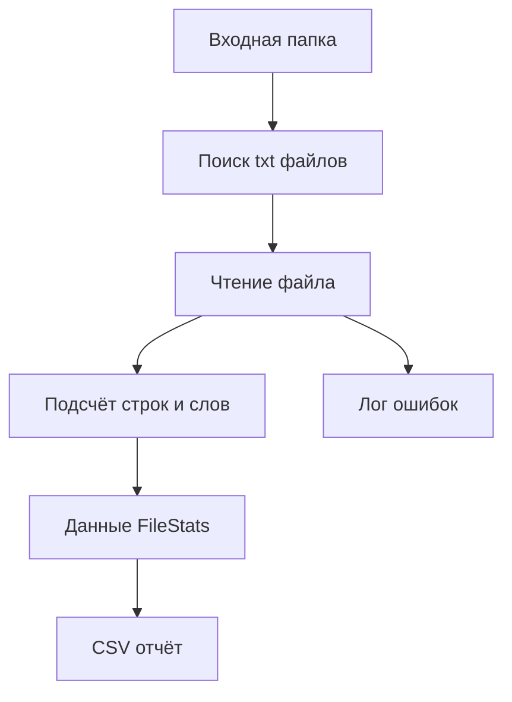

# Example: Python File Processing Utility / Пример Python-утилиты обработки файлов

## 1. Назначение примера

`Python_File_Processing_Utility.md` показывает полный учебный маршрут проектирования простой Python-утилиты для обработки файлов.

Пример связан с индексом примеров: [[docs/06_examples/Examples_Index|Examples Index]].

Пример нужен для новичка, который хочет научиться не просто писать код, а проектировать небольшую систему правильно:

- от идеи;
- через проектирование системы;
- через архитектуру системы;
- через технические требования;
- через выбор инструментария;
- через архитектуру реализации;
- через тестирование;
- до эксплуатации, сопровождения и развития.

Пример не является готовым production-проектом. Это учебная модель мышления.

## 2. Тип системы

Категория примера:

- Scripts / Скрипты автоматизации.

Тип системы:

- локальная Python-утилита;
- CLI-скрипт;
- файловая обработка;
- без GUI;
- без web;
- без embedded;
- без PLC;
- без CNC/CAM-специализации.

Это важно для связи с [[docs/03_roadmaps/05_05_Toolchain_Selection_Category_Rules|Toolchain Selection Category Rules]]: специализированные категории инструментария не выбираются, если они не требуются типом системы.

## 3. Идея системы

Идея:

> Создать Python-утилиту, которая читает все `.txt` файлы из входной папки, считает количество строк и слов в каждом файле, формирует общий отчёт в `.csv` и сохраняет лог обработки.

Ожидаемый результат:

- отчёт `report.csv`;
- лог `processing.log`;
- понятные сообщения об ошибках.

## 4. Предметная область

### 4.1. Участники

- Пользователь
  - Запускает утилиту и получает отчёт.

- Файловая система
  - Хранит входные файлы, отчёт и лог.

### 4.2. Объекты предметной области

- Входная папка
  - Папка, где лежат файлы для обработки.

- Текстовый файл
  - Файл с расширением `.txt`.

- Отчёт
  - CSV-файл с результатами обработки.

- Лог
  - Файл с диагностической информацией.

## 5. Проектирование системы

Связанный roadmap:

- [[docs/03_roadmaps/01_01_Roadmap_System_Design|Roadmap: System Design]]
  - Передаёт: правила проектирования сущностей, данных, правил, состояний, событий, потоков, хранения и ошибок.
  - Используется для: проектирования этой Python-утилиты как системы.
  - Ограничение: не выбирает инструментарий.

Связанная анкета:

- [[docs/04_questionnaires/01_01_Questionnaire_System_Design|Questionnaire: System Design]]
  - Передаёт: вопросы для практического заполнения проектирования системы.
  - Используется для: превращения этого примера в заполняемый учебный кейс.
  - Ограничение: не заменяет roadmap.

### 5.1. Граница системы

Внутри системы:

- поиск `.txt` файлов;
- чтение файлов;
- подсчёт строк и слов;
- формирование отчёта;
- логирование.

Вне системы:

- создание входных файлов пользователем;
- ручное исправление повреждённых файлов;
- анализ отчёта человеком.

### 5.2. Сущности

#### Предметные сущности

- Текстовый файл
  - Объект обработки.

- Отчёт
  - Результат работы системы.

#### Информационные сущности

- FileStats
  - Данные о количестве строк и слов в одном файле.

- ProcessingResult
  - Итог обработки всех файлов.

#### Системные сущности

- FileScanner
  - Ищет входные файлы.

- FileReader
  - Читает содержимое файла.

- StatsCalculator
  - Считает строки и слова.

- ReportWriter
  - Записывает отчёт.

- Logger
  - Фиксирует ход обработки и ошибки.

### 5.3. Данные

Понятие данных раскрывается в [[docs/05_encyclopedia/Data|Data]].

#### Входные данные

- путь к входной папке;
- `.txt` файлы.

#### Внутренние данные

- список найденных файлов;
- содержимое файла;
- количество строк;
- количество слов.

#### Выходные данные

- `report.csv`;
- `processing.log`.

### 5.4. Правила

Понятие правил раскрывается в [[docs/05_encyclopedia/Rules|Rules]].

- Система должна обрабатывать только файлы с расширением `.txt`.
- Если входная папка отсутствует, система должна завершиться с ошибкой.
- Если отдельный файл не удалось прочитать, система должна записать ошибку в лог и продолжить обработку остальных файлов.
- Отчёт должен содержать одну строку на каждый успешно обработанный файл.
- Исходные файлы не должны изменяться.

### 5.5. Состояния и события

Связанные энциклопедические документы:

- [[docs/05_encyclopedia/States|States]]
- [[docs/05_encyclopedia/Events|Events]]

Состояния:

- idle;
- scanning;
- processing;
- writing_report;
- completed;
- failed.

События:

- start_requested;
- input_folder_missing;
- file_found;
- file_read_failed;
- report_written.

### 5.6. Потоки

Связанный документ: [[docs/05_encyclopedia/Flows|Flows]].



### 5.7. Хранение и ошибки

Связанные документы:

- [[docs/05_encyclopedia/Storage|Storage]]
- [[docs/05_encyclopedia/Errors|Errors]]

Система сохраняет:

- отчёт `.csv`;
- лог `.log`.

Ошибки:

- входная папка отсутствует;
- нет файлов для обработки;
- файл не удалось прочитать;
- отчёт не удалось записать;
- лог не удалось создать.

## 6. Проектирование архитектуры системы

Связанный roadmap:

- [[docs/03_roadmaps/02_02_Roadmap_System_Architecture_Design|Roadmap: System Architecture Design]]
  - Передаёт: правила проектирования слоёв, модулей, моделей, интерфейсов и зависимостей.
  - Используется для: архитектурного разделения утилиты.
  - Ограничение: не подменяет архитектуру реализации.

Связанная анкета:

- [[docs/04_questionnaires/02_02_Questionnaire_System_Architecture_Design|Questionnaire: System Architecture Design]]

Связанный энциклопедический документ:

- [[docs/05_encyclopedia/Architecture|Architecture]]

### 6.1. Слои

- Application Layer
  - Управляет сценарием обработки.

- Domain Layer
  - Содержит модель статистики и правила подсчёта.

- Infrastructure Layer
  - Работает с файловой системой, отчётом и логом.

### 6.2. Модули архитектуры

- ProcessingUseCase;
- FileDiscoveryService;
- TextFileReader;
- StatisticsService;
- CsvReportService;
- LoggingService.

### 6.3. Зависимости

- Application Layer может использовать Domain Layer и Infrastructure adapters.
- Domain Layer не должен зависеть от файловой системы.
- Infrastructure Layer может зависеть от стандартных библиотек Python.

## 7. Технические требования

Связанный roadmap:

- [[docs/03_roadmaps/03_03_Roadmap_Technical_Requirements|Roadmap: Technical Requirements]]
  - Передаёт: правила формирования проверяемых требований.
  - Используется для: требований этой утилиты.
  - Ограничение: не выбирает инструменты.

Связанная анкета:

- [[docs/04_questionnaires/03_03_Questionnaire_Technical_Requirements|Questionnaire: Technical Requirements]]

## REQ-TR-001. Проверка входной папки

Система должна проверять существование входной папки перед началом обработки.

Критерий выполнения: при отсутствии входной папки система завершает работу с понятным сообщением об ошибке.

## REQ-TR-002. Обработка только `.txt` файлов

Система должна обрабатывать только файлы с расширением `.txt`.

Критерий выполнения: файлы других форматов игнорируются.

## REQ-TR-003. Подсчёт строк и слов

Система должна считать количество строк и слов для каждого успешно прочитанного файла.

Критерий выполнения: для файла с известным содержимым результат совпадает с ожидаемым.

## REQ-TR-004. Сохранение отчёта

Система должна сохранять отчёт в формате CSV.

Критерий выполнения: после обработки создан файл `report.csv` с колонками `file_name`, `line_count`, `word_count`, `status`, `error_message`.

## REQ-TR-005. Логирование ошибок

Система должна записывать ошибки обработки в лог.

Критерий выполнения: ошибка чтения файла фиксируется в `processing.log`.

## 8. Связь требований с инструментарием

Связанный документ:

- [[docs/00_maps/04_04_Requirements_To_Toolchain_Map|Requirements To Toolchain Map]]
  - Передаёт: способ превращения требований в критерии выбора инструментария.
  - Используется для: раздела выбора Python, стандартной библиотеки и pytest.
  - Ограничение: не выбирает инструмент напрямую.

| Требование | Смысл требования | Категория инструмента | Критерий выбора |
|---|---|---|---|
| REQ-TR-001 | Проверить папку перед обработкой | Язык / стандартная библиотека | Должен уметь проверять пути файловой системы |
| REQ-TR-002 | Фильтровать файлы по расширению | Язык / стандартная библиотека | Должен поддерживать обход директорий |
| REQ-TR-003 | Считать строки и слова | Язык программирования | Должен удобно работать со строками |
| REQ-TR-004 | Записывать CSV | Формат файла / библиотека | Должен поддерживать запись CSV |
| REQ-TR-005 | Записывать лог | Логирование | Должен поддерживать запись логов |

## 9. Выбор инструментария

Связанный roadmap:

- [[docs/03_roadmaps/05_05_Roadmap_Toolchain_Selection|Roadmap: Toolchain Selection]]
  - Передаёт: правила выбора инструментария.
  - Используется для: выбора Python и стандартных библиотек.
  - Ограничение: не меняет требования.

Связанная анкета:

- [[docs/04_questionnaires/05_05_Questionnaire_Toolchain_Selection|Questionnaire: Toolchain Selection]]

Связанный регламент категорий:

- [[docs/03_roadmaps/05_05_Toolchain_Selection_Category_Rules|Toolchain Selection Category Rules]]

### 9.1. Тип системы

- Скрипт / утилита: Да.
- GUI: Нет.
- Web: Нет.
- Embedded: Нет.
- PLC: Нет.
- CNC/CAM: Нет.

### 9.2. Базовый инструментарий

- Python;
- локальный Python runtime;
- VS Code или любой редактор;
- Git;
- pytest;
- стандартный модуль `logging`;
- Markdown.

### 9.3. Прикладной инструментарий

- `pathlib` для путей;
- `csv` для отчёта;
- `logging` для логов.

### 9.4. Специализированный инструментарий

Не применяется.

Причина:

- проект не связан с embedded, PLC, CNC/CAM, промышленной автоматизацией или оборудованием.

## 10. Архитектура реализации

Связанный roadmap:

- [[docs/03_roadmaps/06_06_Roadmap_Implementation_Architecture|Roadmap: Implementation Architecture]]
  - Передаёт: правила построения структуры проекта, модулей, адаптеров, конфигурации и тестов.
  - Используется для: структуры этой утилиты.
  - Ограничение: не пишет код.

Связанная анкета:

- [[docs/04_questionnaires/06_06_Questionnaire_Implementation_Architecture|Questionnaire: Implementation Architecture]]

### 10.1. Структура проекта

```text
file_stats_utility/
|-- src/
|   |-- main.py
|   |-- app/
|   |   |-- processing_use_case.py
|   |-- domain/
|   |   |-- models.py
|   |   |-- statistics_service.py
|   |-- infrastructure/
|   |   |-- file_scanner.py
|   |   |-- text_file_reader.py
|   |   |-- csv_report_writer.py
|   |   |-- logging_setup.py
|-- tests/
|-- examples/
|-- docs/
|-- README.md
```

### 10.2. Правила зависимостей

- `domain` не зависит от `infrastructure`.
- `app` может использовать `domain` и `infrastructure`.
- `infrastructure` не должна содержать бизнес-правила.

## 11. Кодовая структура без полного кода

Главная цель — показать, что код появляется после проектирования.

Минимальный порядок реализации:

1. Создать модель `FileStats`.
2. Реализовать `StatisticsService`.
3. Реализовать поиск файлов.
4. Реализовать чтение файлов.
5. Реализовать запись CSV.
6. Реализовать логирование.
7. Реализовать `ProcessingUseCase`.
8. Подключить `main.py`.
9. Написать тесты.

## 12. Тестирование

Связанный roadmap:

- [[docs/03_roadmaps/07_07_Roadmap_Testing|Roadmap: Testing]]
  - Передаёт: правила проектирования тестов и критериев приёмки.
  - Используется для: проверки этой утилиты.
  - Ограничение: не подменяет эксплуатацию.

Связанная анкета:

- [[docs/04_questionnaires/07_07_Questionnaire_Testing|Questionnaire: Testing]]

### 12.1. Unit-тесты

- `StatisticsService` считает строки и слова правильно.
- `FileScanner` возвращает только `.txt` файлы.

### 12.2. Integration-тесты

- Входная папка → обработка → `report.csv`.
- Файл с ошибкой чтения → ошибка в логе → обработка продолжается.

### 12.3. Критерии приёмки

Система готова, если:

- все `.txt` файлы обработаны;
- файлы других форматов проигнорированы;
- отчёт создан;
- ошибки записаны в лог;
- исходные файлы не изменены.

## 13. Эксплуатация

Связанный roadmap:

- [[docs/03_roadmaps/08_08_Roadmap_Operation|Roadmap: Operation]]
  - Передаёт: правила запуска, рабочих сценариев, ошибок пользователя и логов.
  - Используется для: эксплуатации этой утилиты.
  - Ограничение: не подменяет сопровождение.

Связанная анкета:

- [[docs/04_questionnaires/08_08_Questionnaire_Operation|Questionnaire: Operation]]

### 13.1. Запуск

```text
python src/main.py --input examples/input --output output
```

### 13.2. Результат

После запуска пользователь получает:

- `output/report.csv`;
- `output/processing.log`.

## 14. Сопровождение

Связанный roadmap:

- [[docs/03_roadmaps/09_09_Roadmap_Maintenance|Roadmap: Maintenance]]
  - Передаёт: правила фиксации дефектов, исправлений и регрессии.
  - Используется для: сопровождения этой утилиты.
  - Ограничение: не подменяет развитие системы.

Связанная анкета:

- [[docs/04_questionnaires/09_09_Questionnaire_Maintenance|Questionnaire: Maintenance]]

Возможные дефекты:

- неправильно считается количество слов;
- файл с нестандартной кодировкой не читается;
- отчёт не создаётся при пустой папке;
- лог не содержит нужной диагностики.

## 15. Развитие системы

Связанный roadmap:

- [[docs/03_roadmaps/10_10_Roadmap_System_Evolution|Roadmap: System Evolution]]
  - Передаёт: правила анализа новых возможностей и влияния изменений.
  - Используется для: развития этой утилиты.
  - Ограничение: не маскирует дефекты как новые функции.

Связанная анкета:

- [[docs/04_questionnaires/10_10_Questionnaire_System_Evolution|Questionnaire: System Evolution]]

Возможные направления развития:

- поддержка `.md` файлов;
- подсчёт символов;
- подсчёт частоты слов;
- GUI-интерфейс;
- сохранение истории отчётов;
- обработка вложенных папок;
- экспорт в JSON;
- настройка правил через конфигурационный файл.

### 15.1. Пример анализа развития

Запрос:

> Добавить обработку вложенных папок.

Анализ влияния:

- данные:
  - путь файла должен сохраняться относительно входной папки;
- правила:
  - нужно определить, обрабатывать ли все подпапки или только выбранные;
- потоки:
  - поиск файлов становится рекурсивным;
- тестирование:
  - нужны тестовые папки с вложенной структурой;
- эксплуатация:
  - нужно добавить параметр запуска `--recursive`.

## 16. Выводы

Этот пример показывает главный принцип:

> Даже простая Python-утилита является системой, если у неё есть входные данные, правила, состояния, ошибки, результат, эксплуатация и развитие.

Минимальный правильный маршрут:

```text
Идея
↓
Проектирование системы
↓
Архитектура системы
↓
Технические требования
↓
Выбор инструментария
↓
Архитектура реализации
↓
Код
↓
Тестирование
↓
Эксплуатация
↓
Сопровождение
↓
Развитие
```

## 17. История изменений

- Initial version: создан первый полный учебный пример Python-утилиты обработки файлов.
- Updated: документ приведён к Obsidian wikilinks.
