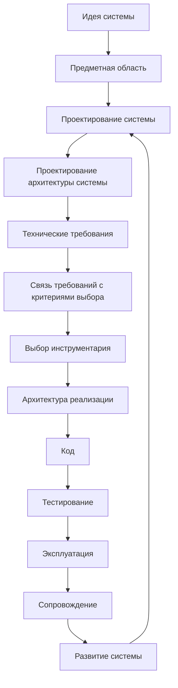
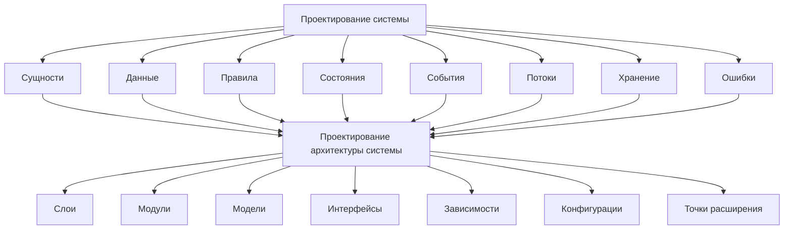
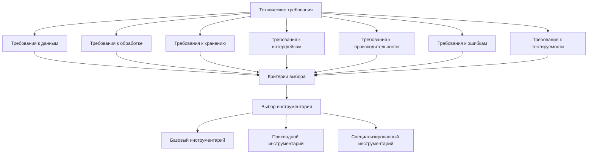
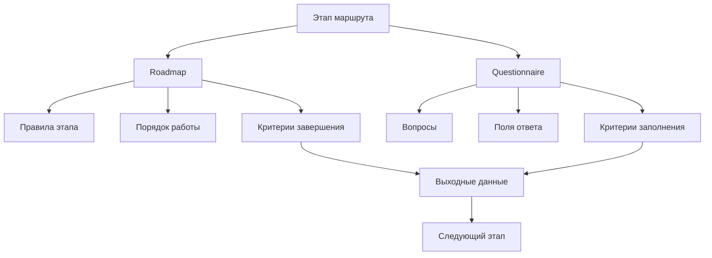
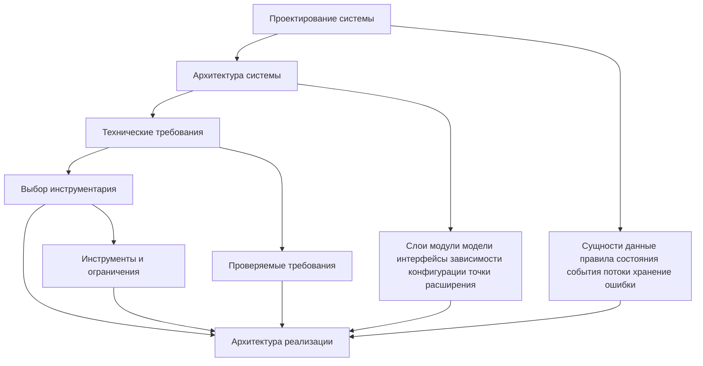
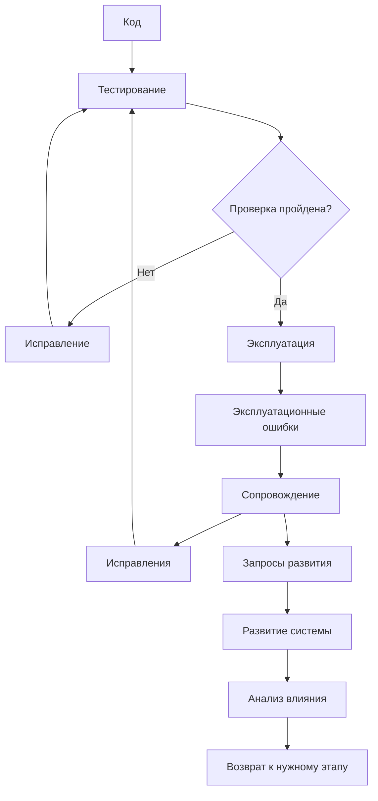
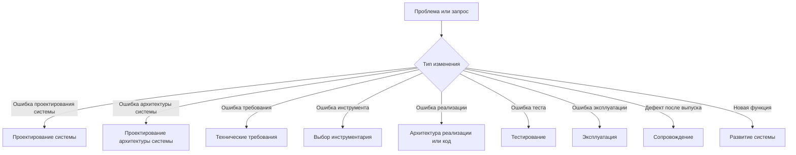
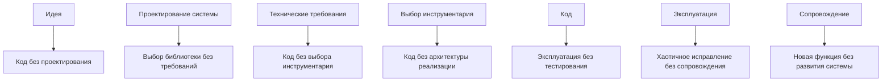
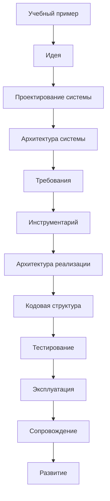

# Development Route Diagrams / Диаграммы маршрута разработки

## 1. Назначение документа

`Development_Route_Diagrams.md` хранит крупные диаграммы маршрута разработки цифровой системы.

Документ показывает путь от идеи до проектирования, требований, выбора инструментария, реализации, тестирования, эксплуатации, сопровождения и развития.

Документ не заменяет [[docs/00_maps/Development_Route_Map|Development Route Map]]. Он визуализирует маршрут и его ключевые возвраты.

## 2. Связанные документы

### Входные документы

- [[docs/00_maps/Development_Route_Map|Development Route Map]]
  - Передаёт: полный маршрут разработки.
  - Используется для: построения диаграмм этапов.
  - Ограничение: текстовый маршрут не заменяет визуальные схемы.

- [[docs/00_maps/Documentation_Map|Documentation Map]]
  - Передаёт: место маршрута в общей документации.
  - Используется для: связи диаграмм с документационными слоями.
  - Ограничение: не раскрывает все переходы маршрута.

- [[docs/00_maps/Requirements_To_Toolchain_Map|Requirements To Toolchain Map]]
  - Передаёт: отдельный переход от требований к критериям выбора инструментария.
  - Используется для: визуализации связи требований и инструментов.
  - Ограничение: не заменяет roadmap выбора инструментария.

## 3. DG-ROUTE-001. Полный маршрут разработки

Назначение диаграммы: показать главный путь от идеи до развития системы.

Связанные документы:

- [[docs/03_roadmaps/Roadmap_System_Design|Roadmap: System Design]]
- [[docs/03_roadmaps/Roadmap_System_Architecture_Design|Roadmap: System Architecture Design]]
- [[docs/03_roadmaps/Roadmap_Technical_Requirements|Roadmap: Technical Requirements]]
- [[docs/00_maps/Requirements_To_Toolchain_Map|Requirements To Toolchain Map]]
- [[docs/03_roadmaps/Roadmap_Toolchain_Selection|Roadmap: Toolchain Selection]]
- [[docs/03_roadmaps/Roadmap_Implementation_Architecture|Roadmap: Implementation Architecture]]
- [[docs/03_roadmaps/Roadmap_Testing|Roadmap: Testing]]
- [[docs/03_roadmaps/Roadmap_Operation|Roadmap: Operation]]
- [[docs/03_roadmaps/Roadmap_Maintenance|Roadmap: Maintenance]]
- [[docs/03_roadmaps/Roadmap_System_Evolution|Roadmap: System Evolution]]

## 4. DG-ROUTE-002. Разделение проектирования системы и архитектуры системы

Назначение диаграммы: показать, что проектирование системы и проектирование архитектуры системы являются разными этапами.

Связанные документы:

- [[docs/03_roadmaps/Roadmap_System_Design|Roadmap: System Design]]
- [[docs/03_roadmaps/Roadmap_System_Architecture_Design|Roadmap: System Architecture Design]]

## 5. DG-ROUTE-003. Разделение требований и инструментария

Назначение диаграммы: показать, что технические требования и выбор инструментария являются разными темами, а связь между ними проходит через критерии выбора.

Связанные документы:

- [[docs/03_roadmaps/Roadmap_Technical_Requirements|Roadmap: Technical Requirements]]
- [[docs/00_maps/Requirements_To_Toolchain_Map|Requirements To Toolchain Map]]
- [[docs/03_roadmaps/Roadmap_Toolchain_Selection|Roadmap: Toolchain Selection]]
- [[docs/03_roadmaps/Toolchain_Selection_Category_Rules|Toolchain Selection Category Rules]]

## 6. DG-ROUTE-004. Связь roadmap и анкет в маршруте

Назначение диаграммы: показать, как каждый этап маршрута имеет roadmap и анкету.

## 7. DG-ROUTE-005. Переход к архитектуре реализации

Назначение диаграммы: показать, какие данные должны быть готовы до проектирования структуры реализации.

Связанные документы:

- [[docs/03_roadmaps/Roadmap_Implementation_Architecture|Roadmap: Implementation Architecture]]
- [[docs/04_questionnaires/Questionnaire_Implementation_Architecture|Questionnaire: Implementation Architecture]]

## 8. DG-ROUTE-006. Тестирование, эксплуатация, сопровождение, развитие

Назначение диаграммы: показать, как система переходит от реализации к реальному жизненному циклу.

Связанные документы:

- [[docs/03_roadmaps/Roadmap_Testing|Roadmap: Testing]]
- [[docs/03_roadmaps/Roadmap_Operation|Roadmap: Operation]]
- [[docs/03_roadmaps/Roadmap_Maintenance|Roadmap: Maintenance]]
- [[docs/03_roadmaps/Roadmap_System_Evolution|Roadmap: System Evolution]]

## 9. DG-ROUTE-007. Возвраты по маршруту

Назначение диаграммы: показать, что проблема или запрос может возвращать проект не только к коду, но и к требованиям, архитектуре или выбору инструментария.

## 10. DG-ROUTE-008. Запрещённые переходы

Назначение диаграммы: показать переходы, которые нарушают порядок разработки.

Все переходы на этой диаграмме являются запрещёнными.

## 11. DG-ROUTE-009. Маршрут для учебного примера

Назначение диаграммы: показать, как учебный пример должен проходить тот же маршрут, что и реальный проект.

Связанные документы:

- [[docs/06_examples/Examples_Index|Examples Index]]
- [[docs/06_examples/Scripts/Python_File_Processing_Utility|Python File Processing Utility]]

## 12. Правила использования диаграмм маршрута

- Диаграммы маршрута используются для ориентации в процессе разработки.
- Диаграммы маршрута не заменяют roadmap-документы.
- Если маршрут меняется, нужно обновить [[docs/00_maps/Development_Route_Map|Development Route Map]] и этот документ.
- Если создаётся новая анкета или roadmap, нужно проверить, нужен ли новый узел на диаграммах маршрута.
- Запрещённые переходы должны оставаться явно видимыми.

## 13. Выходные связи

Этот документ должен использоваться в:

- [[docs/00_maps/Development_Route_Map|Development Route Map]]
- [[docs/00_maps/Documentation_Map|Documentation Map]]
- [[docs/07_diagrams/System_Map|System Map]]
- [[docs/06_examples/Examples_Index|Examples Index]]
- [[docs/08_books/Book_01_Foundations|Book 01: Foundations]]

## 14. История изменений

- Initial version: созданы диаграммы полного маршрута разработки, разделения проектирования системы и архитектуры, разделения требований и инструментария, жизненного цикла тестирования, эксплуатации, сопровождения и развития.
