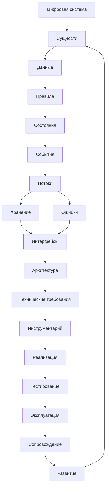
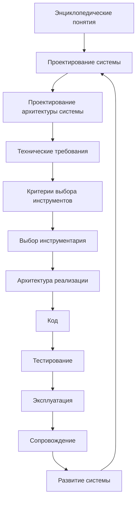
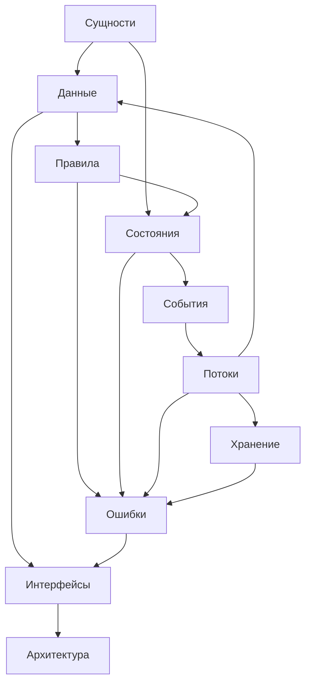
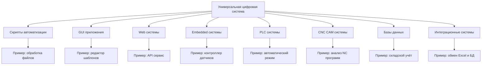
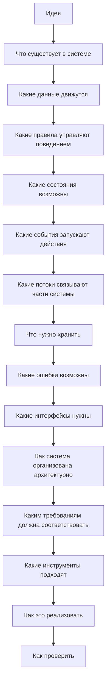

# System Map / Карта цифровой системы

## 1. Назначение документа

`System_Map.md` хранит крупные диаграммы универсальной структуры цифровой системы.

Документ показывает, как базовые понятия цифрового мира связаны между собой: сущности, данные, правила, состояния, события, потоки, хранение, ошибки, интерфейсы, архитектура, требования, инструментарий, реализация, тестирование, эксплуатация, сопровождение и развитие.

Документ не заменяет энциклопедию, roadmap-документы и анкеты. Документ даёт визуальную карту, к которой можно возвращаться при проектировании.

## 2. Связанные документы

### Входные документы

- [[PROJECT_SCOPE|PROJECT_SCOPE]]
  - Передаёт: масштаб проекта и центральную идею универсальной цифровой системы.
  - Используется для: построения общей карты системы.
  - Ограничение: не раскрывает все понятия подробно.

- [[docs/00_maps/Documentation_Map|Documentation Map]]
  - Передаёт: место слоя диаграмм в документации.
  - Используется для: связи этой карты с остальными слоями.
  - Ограничение: не является картой самой цифровой системы.

- [[docs/00_maps/Knowledge_Layer_Map|Knowledge Layer Map]]
  - Передаёт: место энциклопедии, roadmap, анкет, примеров и книг.
  - Используется для: связи понятий с документами базы знаний.
  - Ограничение: не описывает полный жизненный цикл системы.

### Основные тематические документы

- [[docs/05_encyclopedia/Entities|Entities]]
- [[docs/05_encyclopedia/Data|Data]]
- [[docs/05_encyclopedia/Rules|Rules]]
- [[docs/05_encyclopedia/States|States]]
- [[docs/05_encyclopedia/Events|Events]]
- [[docs/05_encyclopedia/Flows|Flows]]
- [[docs/05_encyclopedia/Storage|Storage]]
- [[docs/05_encyclopedia/Errors|Errors]]
- [[docs/05_encyclopedia/Interfaces|Interfaces]]
- [[docs/05_encyclopedia/Architecture|Architecture]]

## 3. DG-SYS-001. Универсальная структура цифровой системы

Назначение диаграммы: показать общий состав цифровой системы как цепочку смысловых уровней.

## 4. DG-SYS-002. Переход от понятий к разработке

Назначение диаграммы: показать, как энциклопедические понятия переходят в roadmap, анкеты и реализацию.

Связанные документы:

- [[docs/03_roadmaps/Roadmap_System_Design|Roadmap: System Design]]
- [[docs/03_roadmaps/Roadmap_System_Architecture_Design|Roadmap: System Architecture Design]]
- [[docs/03_roadmaps/Roadmap_Technical_Requirements|Roadmap: Technical Requirements]]
- [[docs/00_maps/Requirements_To_Toolchain_Map|Requirements To Toolchain Map]]
- [[docs/03_roadmaps/Roadmap_Toolchain_Selection|Roadmap: Toolchain Selection]]
- [[docs/03_roadmaps/Roadmap_Implementation_Architecture|Roadmap: Implementation Architecture]]
- [[docs/03_roadmaps/Roadmap_Testing|Roadmap: Testing]]
- [[docs/03_roadmaps/Roadmap_Operation|Roadmap: Operation]]
- [[docs/03_roadmaps/Roadmap_Maintenance|Roadmap: Maintenance]]
- [[docs/03_roadmaps/Roadmap_System_Evolution|Roadmap: System Evolution]]

## 5. DG-SYS-003. Связь базовых понятий системы

Назначение диаграммы: показать не линейный маршрут, а смысловые зависимости между базовыми понятиями.

## 6. DG-SYS-004. Цифровая система в разных областях

Назначение диаграммы: показать, что универсальная структура применяется к разным видам цифровых систем.

Правило чтения диаграммы: верхний уровень содержит категории систем, нижний уровень содержит примеры внутри соответствующих категорий.

Связанный документ: [[docs/06_examples/Examples_Index|Examples Index]].

## 7. DG-SYS-005. Контрольная карта проектного мышления

Назначение диаграммы: показать, какие вопросы должен задавать проектировщик до перехода к коду.

## 8. Правила использования диаграмм из документа

- Диаграммы используются как навигационные карты, а не как замена текстового проектирования.
- Если диаграмма применяется в roadmap-документе, рядом должна быть ссылка на этот файл.
- Если диаграмма применяется в книге, она должна сохранять тот же идентификатор `DG-SYS-*`.
- Если диаграмма устарела, нужно обновить этот документ и документы, которые на неё ссылаются.
- Mermaid-синтаксис должен оставаться совместимым с Obsidian.

## 9. Выходные связи

Этот документ должен использоваться в:

- [[docs/00_maps/Documentation_Map|Documentation Map]]
- [[docs/00_maps/Knowledge_Layer_Map|Knowledge Layer Map]]
- [[docs/03_roadmaps/Roadmap_System_Design|Roadmap: System Design]]
- [[docs/05_encyclopedia/Architecture|Architecture]]
- [[docs/06_examples/Examples_Index|Examples Index]]
- [[docs/08_books/Book_01_Foundations|Book 01: Foundations]]

## 10. История изменений

- Initial version: создана универсальная карта цифровой системы и базовые Mermaid-диаграммы для слоя `docs/07_diagrams`.
