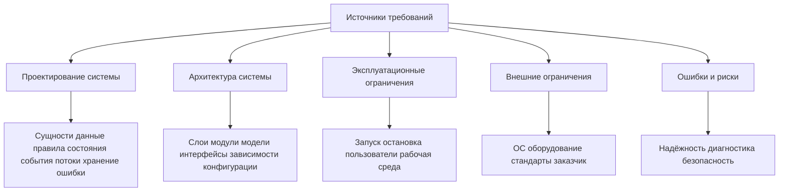
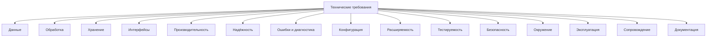
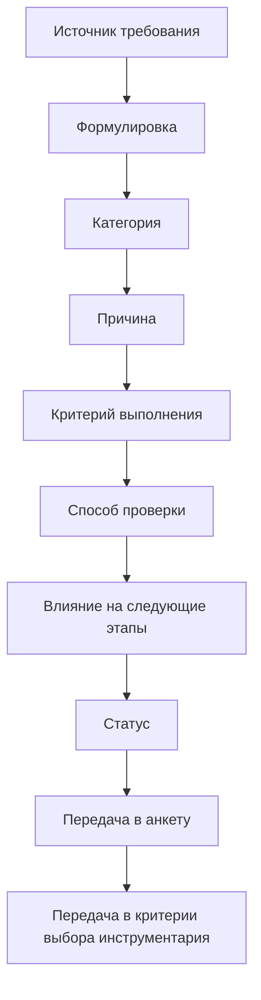
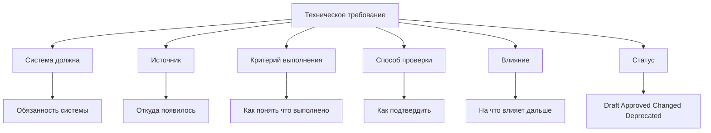
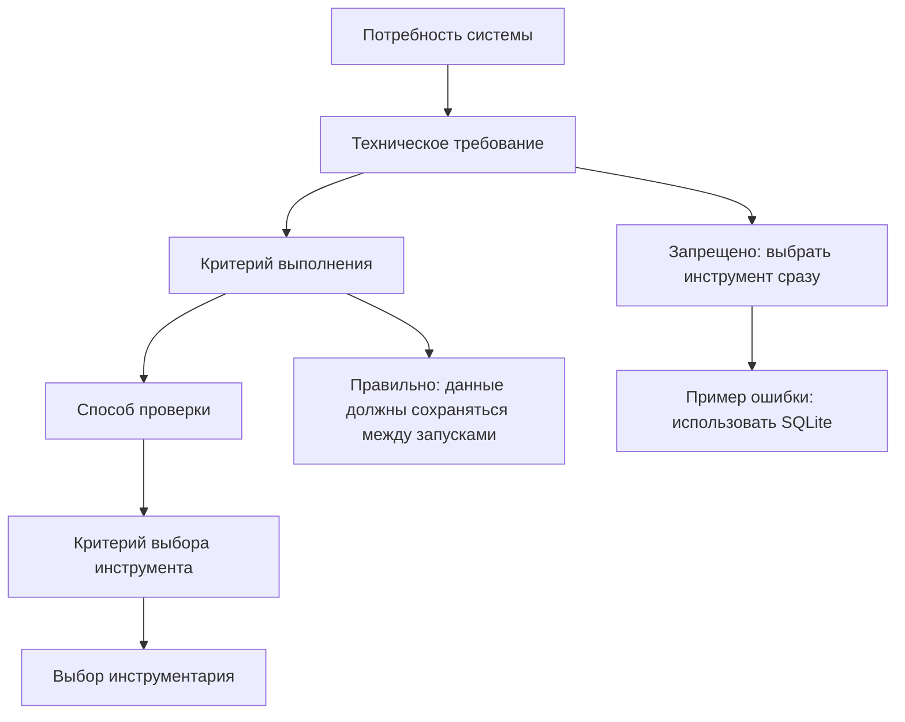
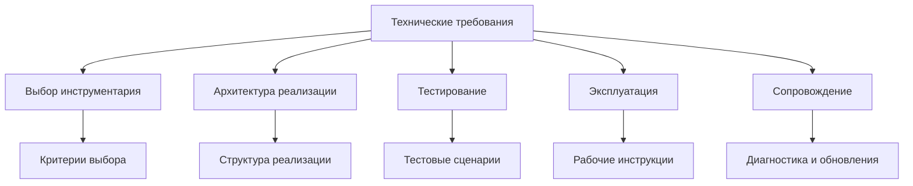
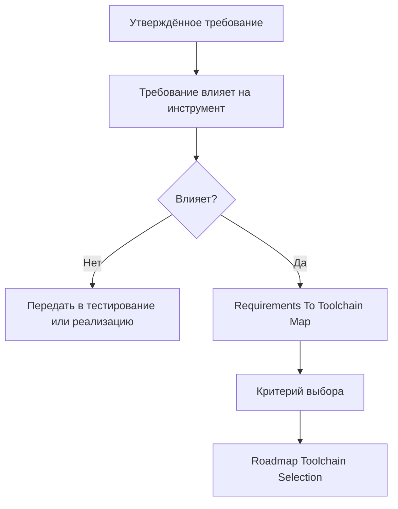
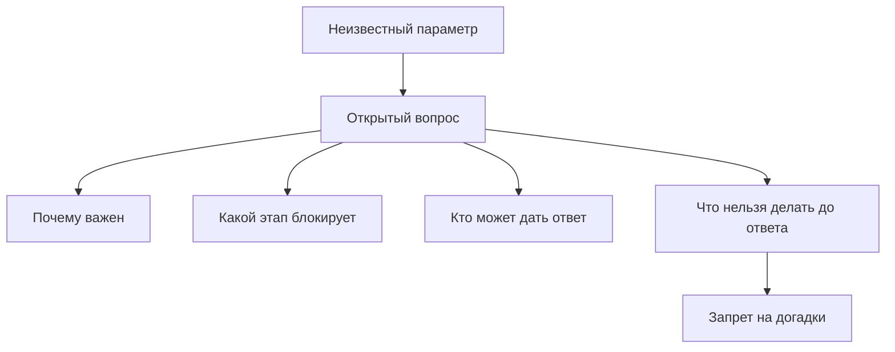

# Roadmap Technical Requirements Diagrams / Диаграммы технических требований

## 1. Назначение документа

`03_03_Roadmap_Technical_Requirements_Diagrams.md` хранит диаграммы этапа формирования технических требований.

Документ визуализирует, как проектные и архитектурные решения превращаются в проверяемые требования, критерии выполнения, способы проверки и входные данные для выбора инструментария.

Документ не заменяет [[docs/03_roadmaps/03_Roadmap_Technical_Requirements|Roadmap: Technical Requirements]] и [[docs/04_questionnaires/03_Questionnaire_Technical_Requirements|Questionnaire: Technical Requirements]].

## 2. Связанные документы

- [[docs/03_roadmaps/03_Roadmap_Technical_Requirements|Roadmap: Technical Requirements]]
- [[docs/04_questionnaires/03_Questionnaire_Technical_Requirements|Questionnaire: Technical Requirements]]
- [[docs/03_roadmaps/01_Roadmap_System_Design|Roadmap: System Design]]
- [[docs/03_roadmaps/02_Roadmap_System_Architecture_Design|Roadmap: System Architecture Design]]
- [[docs/00_maps/04_Requirements_To_Toolchain_Map|Requirements To Toolchain Map]]
- [[docs/07_diagrams/01_Roadmap_System_Design_Diagrams|Roadmap System Design Diagrams]]
- [[docs/07_diagrams/02_Roadmap_System_Architecture_Diagrams|Roadmap System Architecture Diagrams]]

## 3. DG-TR-001. Источники технических требований

## 4. DG-TR-002. Классификация технических требований

## 5. DG-TR-003. Жизненный цикл требования

## 6. DG-TR-004. Проверяемое требование

## 7. DG-TR-005. Требования не выбирают инструменты

## 8. DG-TR-006. Влияние требований на следующие этапы

## 9. DG-TR-007. Выход в карту требований и инструментария

## 10. DG-TR-008. Открытые вопросы требований

## 11. История изменений

- Initial version: созданы диаграммы этапа технических требований.
